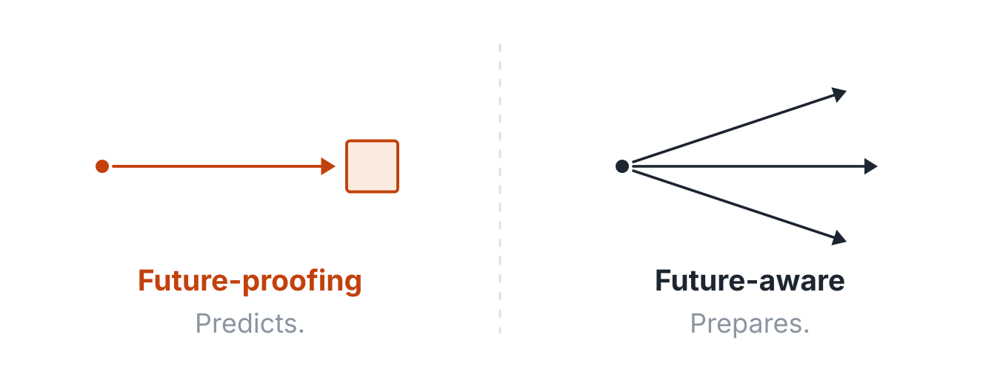

# Drop folder: blog posts

Put a Markdown file and its featured image here with the **same file name**, then commit and push to `main`:

```
incoming/blog/leader-election-in-net.md
incoming/blog/leader-election-in-net.png     ← featured image (.png, .jpg, .jpeg, or .webp)
incoming/blog/diagram-1.png                  ← optional: any other image the post references
```

The `Import content` GitHub Action moves them to `site/src/content/blog/YYYY/MM/<slug>/`, commits, and deploys. Processed files are removed from this folder. This README is ignored.

## Front matter

Everything is optional except that a title must come from somewhere (front matter, the first `# Heading`, or the file name).

```md
---
title: "Leader Election in .NET: Picking One Boss Without Creating Two"
date: 2026-02-04            # defaults to today
slug: leader-election-in-net  # defaults to a slug of the title
description: "One-sentence summary used for cards and the RSS feed."  # defaults to the first paragraph
categories: ["patterns"]    # defaults to ["blog"]; use existing slugs: patterns, efcore, htmx, rust, terraform, http-rest, genetic-algorithms, network-book-sample, biz-software, simplicity-first, speaking, ai, blog
tags: ["dotnet", "csharp", "distributed"]
draft: false                # true hides the post from the site but keeps it in the repo
---

Body in Markdown. Reference other images in this folder by file name:


```

## Rules the importer enforces

- A featured image with the same base name as the Markdown file is required.
- The slug must be unique across all years. If it collides with an existing post in a different month, the import fails and tells you; set `slug:` to something else, or keep the same slug to **update** the existing post in place.
- The site is built before anything is committed, so a front-matter mistake fails the Action instead of breaking the live site.
- Open a pull request that touches this folder to get a dry run (import + build, no commit).
