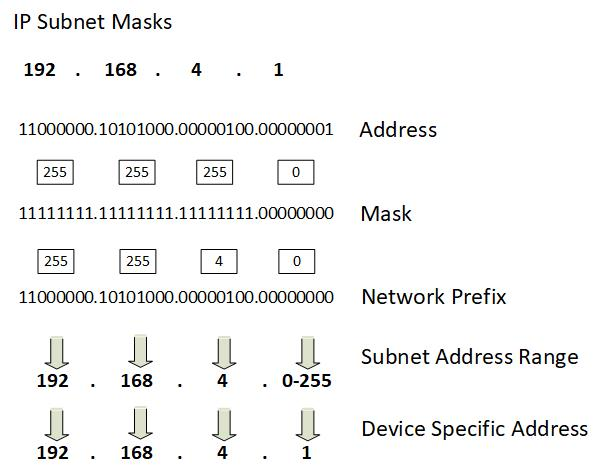

NOTE - This post is an example from the book **"Beyond Boundaries: Networking Programming with C# 12 and .NET 8"**. For a deeper dive into socket programming and more networking concepts, visit [https://csharp-networking.com/](https://csharp-networking.com/) or get your copy of the book on [Leanpub](https://leanpub.com/csharp-networking/).

In today's hyper-connected world, where everything from your smartphone to your coffee machine can be online, understanding networking is no longer just for IT pros. At the heart of all this connectivity lies IP addressing and subnetting—the unsung heroes of the digital age. These concepts are the foundation of how devices communicate and share data seamlessly across networks, ensuring everything works. But how does it all happen? Let's break it down.

Think of an IP address as the digital equivalent of a street address. Just like the post office uses your address to deliver mail to the right home, devices on a network use IP addresses to send and receive data.

* * *

## What Is IP Addressing?

There are two main versions of IP addresses in use today:

- **IPv4**: The older, more familiar format that looks like this: 192.168.1.1. It uses a 32-bit structure, which means there are around 4.3 billion possible addresses. Back when the internet was still new, this seemed like plenty. Spoiler alert—it wasn't.

- **IPv6**: Enter the modern solution to the address shortage. IPv6 uses a 128-bit structure, offering trillions upon trillions of unique addresses. Think of IPv6 as the unlimited buffet of IP addressing.

Each IP address is divided into two parts:

1. The **network portion** identifies the network the device belongs to.

3. The **host portion** identifies the specific device on that network.

This split allows devices to talk to each other within a network and across the broader internet.

* * *

## Subnetting: Breaking Big Networks Into Manageable Pieces

Imagine a massive city where every house is on one endless street. Chaos, right? Subnetting is like dividing that city into neighborhoods. It organizes networks into smaller, more manageable pieces, improving efficiency and making network management easier.

Here's why subnetting matters:

- **Efficient Use of IPs**: Many IP addresses would go unused without subnetting, especially in smaller networks.

- **Improved Security**: Subnetting creates boundaries that limit the spread of potential threats within a network.

- **Reduced Congestion**: By breaking networks into smaller subnets, we reduce broadcast traffic and keep things running smoothly.

Subnetting relies on a tool called the **subnet mask**. This mask acts as a guide, separating an IP address's network and host portions. For example, if you have the IP address 192.168.1.25 and a subnet mask 255.255.255.0, the first three sections (192.168.1) identify the network, and the last part (.25) points to the specific device.

* * *

## CIDR Notation: Making IPs Easier to Manage

Have you ever seen an IP address with something like "/24" at the end? That's CIDR notation, short for Classless Inter-Domain Routing. It's a simplified way to show the subnet mask. The "/24" means the first 24 bits of the address are for the network portion, while the rest are for hosts.

Why does CIDR matter?

- **It's efficient**: CIDR allows for better IP address allocation by tailoring subnet sizes to actual needs.

- **It reduces complexity**: Instead of using long, clunky subnet masks, CIDR keeps things short and sweet.

For example, you might manage a network with multiple subnets. One subnet might need room for 50 devices, while another only needs 10. CIDR lets you create the perfect size for each, optimizing the use of IP addresses.

* * *

## Why Should You Care?

Whether designing a network, troubleshooting connectivity issues, or just trying to figure out why your smart fridge won't connect to Wi-Fi, understanding IP addressing and subnetting gives you the tools to solve problems and make systems run more efficiently.

At their core, IP addressing and subnetting aren't just technical jargon—they're the backbone of our connected world. Mastering these concepts empowers you to design scalable, secure, and future-proof networks and inspires you to create efficient and effective solutions in the digital realm.

So, the next time you see an IP address or hear the term "subnet mask," remember this: you're looking at the invisible threads that hold our digital universe together. And now, you're one step closer to mastering them.
