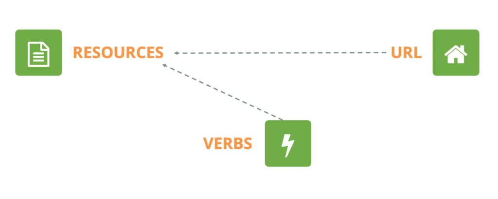
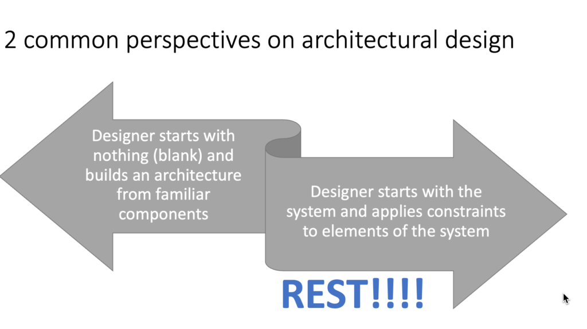

If you've worked with web services, you've probably heard of REST. It's everywhere—from APIs powering your favorite apps to backend systems handling millions of users. But what exactly is REST, and why is it the go-to approach for modern web development? Let’s break it down.

* * *

## What is REST? A Simple Definition

REST stands for **Representational State Transfer**, and while that sounds like something from a PhD dissertation (because it is), the concept itself is pretty intuitive.

At its core, REST is a set of architectural principles for designing networked applications. Instead of complex mechanisms like SOAP (Simple Object Access Protocol) or RPC (Remote Procedure Call), RESTful systems use simple HTTP requests to interact with resources.

Think of REST as how the web was meant to work: clients request resources, and servers respond with representations of those resources. A resource could be anything—a user profile, a blog post, a product listing—and REST provides a consistent way to access, modify, and delete them using standard HTTP methods like `GET`, `POST`, `PUT`, and `DELETE`.

* * *

## A Brief History: From SOAP to REST

REST wasn’t created in a vacuum. It was introduced in **2000** by Roy Fielding in his doctoral dissertation at UC Irvine. Fielding, one of the key architects behind HTTP, observed that early web services were overly complex, often requiring rigid XML-based messaging protocols like SOAP.

Back in the day, if you wanted to expose data from a web service, you often had to:

- Define a strict XML schema.

- Use heavy SOAP envelopes.

- Deal with complex contracts that dictate precisely how data should be exchanged.

Fielding proposed REST as an alternative: a lightweight, scalable, and flexible way to build web services by leveraging **stateless communication over HTTP**. Instead of sending bloated XML requests, REST APIs let clients simply send an HTTP request and get back a lightweight JSON (or even plain text or XML) response.

* * *

## REST vs. Traditional Web Services

To understand why REST won the web, let’s compare it to older approaches:

| Feature | REST | SOAP/RPC |
| --- | --- | --- |
| **Message Format** | JSON, XML, or other lightweight formats | XML-based SOAP messages |
| **Complexity** | Simple, human-readable | Verbose, requires strict message formats |
| **Performance** | Fast, minimal overhead | Slower due to XML parsing and transport overhead |
| **Scalability** | Stateless, easier to scale | Often stateful, making scaling more complex |
| **Ease of Use** | Works with standard HTTP methods | Requires additional protocols |

REST’s simplicity, speed, and ease of integration made it the dominant approach for APIs, while SOAP has mostly faded into niche use cases like enterprise applications and legacy systems.

* * *

## Why REST Matters

### 1\. **It Leverages HTTP as Intended**

RESTful APIs don’t reinvent the wheel—they use HTTP the way it was designed. Resources are accessed via `GET`, modified via `PUT` or `PATCH`, created via `POST`, and deleted via `DELETE`.

### 2\. **It’s Scalable and Stateless**

REST follows a stateless architecture, meaning each request contains all the necessary information to process it. This makes it much easier to scale compared to systems that maintain session state on the server.

### 3\. **It’s Lightweight and Fast**

By using formats like JSON, REST APIs can transmit data with minimal overhead, making them ideal for modern web and mobile applications.

### 4\. **It’s Universally Supported**

Because REST works over HTTP, it’s compatible with nearly every programming language and platform, making it the default choice for modern API development.

* * *

## Wrapping Up

REST isn’t just another technology buzzword—it’s the foundation of most modern web APIs. Its simplicity, scalability, and efficiency have made it the standard for building distributed systems. Whether you’re calling an API to fetch data or designing your own, understanding REST is essential for working with today’s web technologies.
