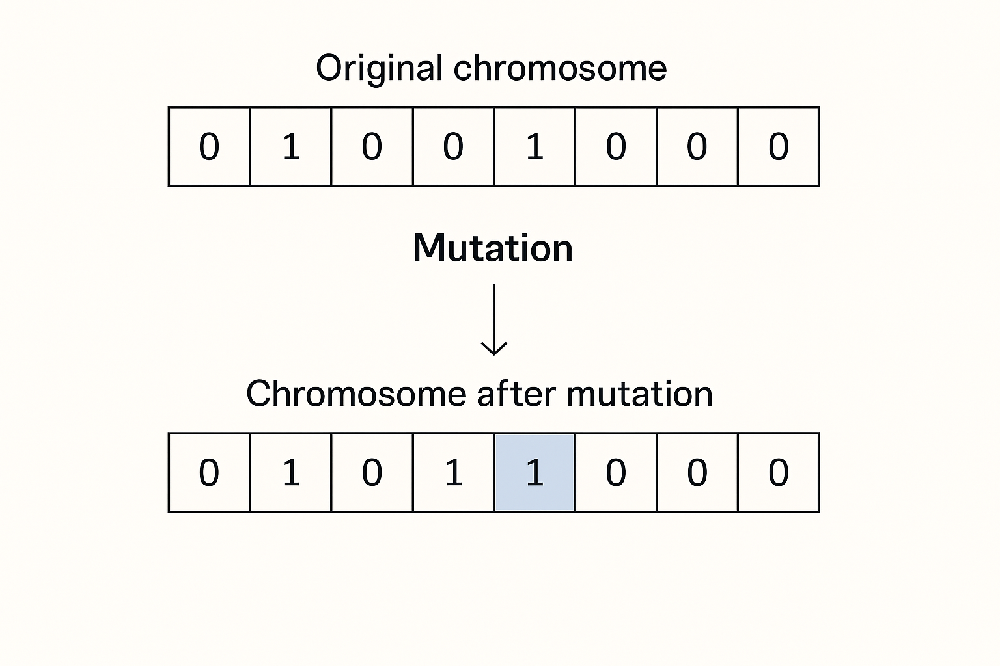

In biological evolution, mutations are rare, random changes in DNA that introduce new traits. While many mutations are neutral or even harmful, some spark evolutionary leaps. In genetic algorithms, **mutation serves the same purpose**: injecting fresh variations into the population to avoid stagnation and premature convergence.

Without mutation, a genetic algorithm can easily fall into local optima—improving early on but plateauing before reaching the best solution. Mutation helps keep the algorithm dynamic, ensuring exploration continues even when the population becomes homogeneous.

Today, we explore how mutation works, its importance in the evolutionary process, and how to implement it in C#.

## Why Mutation Is Essential

Crossover alone cannot generate new genes—it only recombines existing ones. If all chromosomes in the population become too similar, crossover will help shuffle away the sameness. Mutation ensures the genetic pool retains diversity over time.

### Key Benefits of Mutation

- **Prevents Premature Convergence**: Avoids getting stuck in local maxima or minima.

- **Maintains Diversity**: Introduces new alleles into the population.

- **Supports Exploration**: Enables discovery of parts of the search space not reachable by crossover.

However, too many mutations can make the algorithm behave like a random search. The key is to strike the right balance.

## Mutation in Practice

In C#, mutation is typically applied to each gene with a small probability (e.g., 0.5% to 5%). If the condition is met, the gene is replaced with a randomly selected alternative from the gene pool.

### Example: Character-Based Chromosome

Assume we are evolving strings. Each gene is a character from a predefined gene pool.

```csharp
public void Mutate(double mutationRate)
{
    for (int i = 0; i < Genes.Length; i++)
    {
        if (Random.Shared.NextDouble() < mutationRate)
        {
            Genes[i] = RandomGene();
        }
    }
}
```

Here, `RandomGene()` returns a random character from the allowed gene pool:

```csharp
private static readonly string GenePool = "ABCDEFGHIJKLMNOPQRSTUVWXYZabcdefghijklmnopqrstuvwxyz ,.!";

private static char RandomGene()
{
    return GenePool[Random.Shared.Next(GenePool.Length)];
}
```

A mutation rate of 0.01 means each gene has a 1% chance of being replaced.



## Best Practices for Mutation

### Use Low Rates

Mutation is meant to fine-tune the population, not dominate the search. Recommended mutation rates:

- **Binary strings**: 1% to 2%

- **Character sequences**: 0.5% to 1%

- **Complex objects**: custom logic, typically sparse changes

### Combine with Crossover

Mutation alone is a random walk. It is most effective when used after crossover to introduce slight deviations in the offspring.

```csharp
var child = parent1.Crossover(parent2);
child.Mutate(0.01);
```

### Monitor Diversity

Track population diversity to adjust the mutation rate dynamically. If diversity drops below a threshold, slightly increase the rate to reintroduce variability.

## Impact of Mutation on Convergence

Without mutation:

- The population converges quickly

- The risk of suboptimal results increases

- Search space coverage shrinks over time

With mutation:

- The algorithm retains the ability to explore

- It may take longer to converge, but with better global performance

- Solutions can recover from early missteps

Mutation is what gives the algorithm its evolutionary edge. It enables occasional leaps in solution space, which are crucial for escaping the gravitational pull of local optima.

## Up Next

Tomorrow, we’ll write the mutation operator with randomness in mind, making sure it integrates seamlessly into our algorithm and allows for flexible tuning. You’ll build a reusable component that can be customized for your domain-specific chromosomes.

Small changes can lead to significant improvements. Mutation is proof of that.
