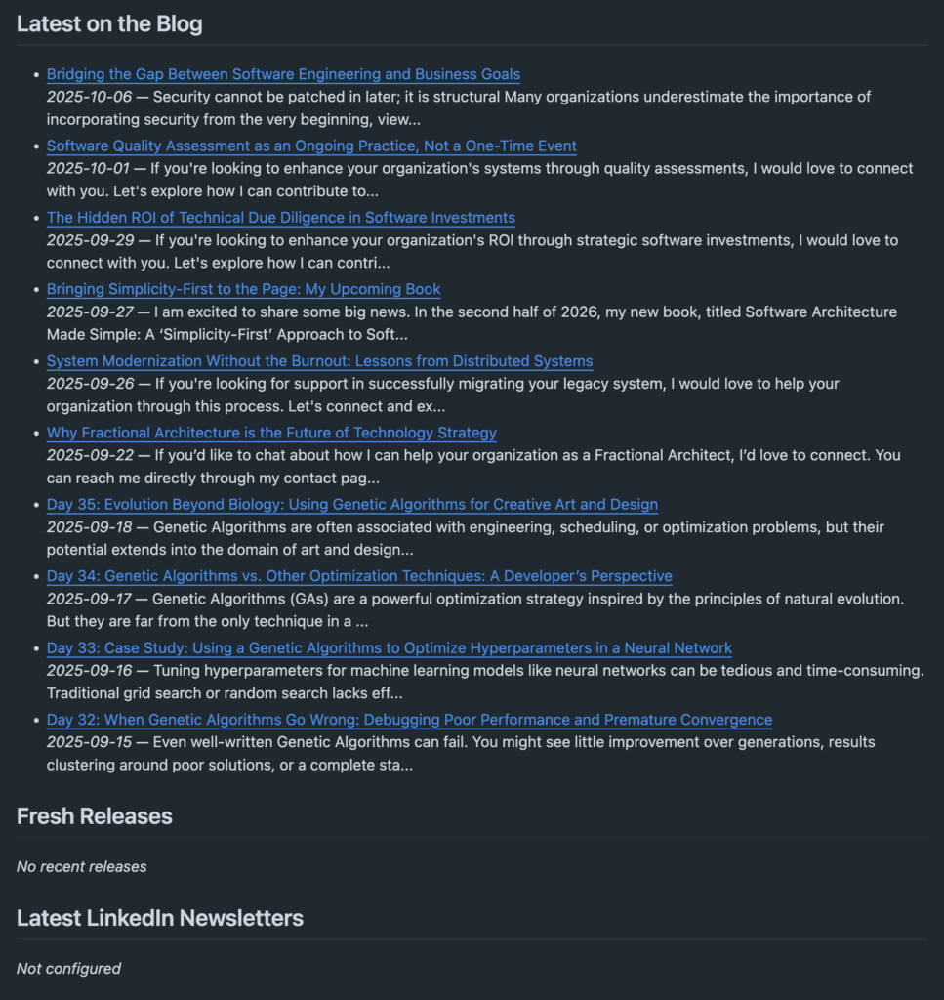

Want your GitHub profile to look alive without spending your weekends copy-pasting links? Let’s wire it to your actual work: blog posts from WordPress, newly published releases, and your newsletter issues. You will get a profile that quietly refreshes itself on a schedule and on events.

We will use:

- A **profile README** repo (`github.com/<you>/<you>`)

- A **GitHub Actions** workflow that runs on a schedule and optional webhooks

- A tiny **Python script** that fetches data and rewrites sections between markers

- RSS for WordPress, GitHub’s API for releases, and a practical workaround for LinkedIn

> Demo vibe: low maintenance, high signal. Set it once, let it run.

* * *

## What you will build

Your profile will contain three live sections:



The Action regenerates these blocks and commits changes only when the content actually changes.

* * *

## Prerequisites

- A GitHub account with a **profile repo** named exactly your username  
    Example: if your handle is `cwoodruff`, the repo is `` `cwoodruff`/`cwoodruff` ``

- WordPress category or site feed. Example:  
    `https://woodruff.dev/category/blog/feed/`

- Python packages used in CI: `feedparser`, `requests`, `PyYAML` (installed by the workflow)

- For LinkedIn, one of:
    - Cross-post your newsletter to your blog (recommended)
    
    - Or provide a stable RSS URL
    
    - Or provide a small JSON cache URL you control (via Zapier/Make/n8n or a gist)

* * *

## Step 1: Add markers to your profile README

In your profile repo, edit `README.md` and add:

```
## Latest on the Blog
<!-- WP:START -->
<!-- WP:END -->

## Fresh Releases
<!-- REL:START -->
<!-- REL:END -->

## Latest LinkedIn Newsletters
<!-- LI:START -->
<!-- LI:END -->

```

You can place these anywhere in your README and style them however you like. The markers must stay intact.

* * *

## Step 2: Add the workflow

Create `.github/workflows/update-profile.yml`:

```yaml
name: Update Profile

on:
  schedule:
    - cron: "*/30 * * * *"   # every 30 minutes
  workflow_dispatch: {}
  repository_dispatch:
    types: [wp-post-published, li-newsletter-published, release-published]

permissions:
  contents: write

jobs:
  build:
    runs-on: ubuntu-latest
    steps:
      - name: Checkout
        uses: actions/checkout@v4

      - name: Set up Python
        uses: actions/setup-python@v5
        with:
          python-version: "3.11"

      - name: Install deps
        run: |
          python -m pip install --upgrade pip
          pip install feedparser requests PyYAML

      - name: Update README
        env:
          GITHUB_TOKEN: ${{ secrets.GITHUB_TOKEN }}
          GH_PAT: ${{ secrets.GH_PAT }} # optional if you need cross-repo access
          WORDPRESS_FEED: "https://woodruff.dev/category/blog/feed/"
          GITHUB_USER: "<your-username>"
          # Comma-separated repos to watch releases for; leave blank to scan all your public repos
          RELEASE_REPOS: "owner1/repoA,owner2/repoB"
          LINKEDIN_RSS: ""                 # set if you have one
          LINKEDIN_WEBHOOK_CACHE: ""       # set to a JSON list URL if using a low-code relay
          ITEMS_PER_SECTION: "10"
        run: |
          python scripts/update_readme.py

      - name: Commit changes
        run: |
          if [[ -n "$(git status --porcelain)" ]]; then
            git config user.name "github-actions[bot]"
            git config user.email "41898282+github-actions[bot]@users.noreply.github.com"
            git add README.md
            git commit -m "chore: refresh profile sections"
            git push
          else
            echo "No changes."
          fi

```

* * *

## Step 3: Add the updater script

Create `scripts/update_readme.py`:

```python
import os, re, requests, feedparser
from datetime import datetime, timezone

README = "README.md"

def between(s, start, end, new_block):
    pattern = re.compile(rf"({re.escape(start)})(.*)({re.escape(end)})", re.S)
    return pattern.sub(rf"\1\n{new_block}\n\3", s)

def fmt_item(title, url, meta=None):
    if meta:
        return f"- [{title}]({url})  \n  {meta}"
    return f"- [{title}]({url})"

def fetch_wordpress(feed_url, limit):
    d = feedparser.parse(feed_url)
    items = []
    for e in d.entries[:limit]:
        title = e.title
        link = e.link
        date = None
        if getattr(e, "published_parsed", None):
            date = datetime(*e.published_parsed[:6], tzinfo=timezone.utc).date().isoformat()
        elif getattr(e, "updated_parsed", None):
            date = datetime(*e.updated_parsed[:6], tzinfo=timezone.utc).date().isoformat()
        summary = (getattr(e, "summary", "") or "").strip()
        summary = re.sub("<.*?>", "", summary)
        if len(summary) > 160:
            summary = summary[:157] + "..."
        meta = f"*{date}* — {summary}" if date else summary
        items.append(fmt_item(title, link, meta))
    return "\n".join(items) if items else "_No recent posts_"

def gh_headers():
    pat = os.environ.get("GH_PAT") or os.environ.get("GITHUB_TOKEN")
    return {"Authorization": f"Bearer {pat}", "Accept": "application/vnd.github+json"}

def fetch_release_candidates(user, release_repos):
    headers = gh_headers()
    repos = []
    if release_repos:
        repos = [r.strip() for r in release_repos.split(",") if r.strip()]
    else:
        page = 1
        while True:
            resp = requests.get(f"https://api.github.com/users/{user}/repos?per_page=100&page={page}",
                                headers=headers, timeout=30)
            if resp.status_code != 200:
                break
            data = resp.json()
            if not data:
                break
            for r in data:
                repos.append(f"{r['owner']['login']}/{r['name']}")
            page += 1
    return repos

def fetch_latest_releases(repos, limit):
    headers = gh_headers()
    rels = []
    for full in repos:
        owner, name = full.split("/", 1)
        r = requests.get(f"https://api.github.com/repos/{owner}/{name}/releases?per_page=1",
                         headers=headers, timeout=30)
        if r.status_code == 200 and r.json():
            rel = r.json()[0]
            rels.append({
                "repo": full,
                "tag": rel.get("tag_name"),
                "name": rel.get("name") or rel.get("tag_name"),
                "url": rel.get("html_url"),
                "published_at": rel.get("published_at")
            })
    rels.sort(key=lambda x: x["published_at"] or "", reverse=True)
    out = []
    for r in rels[:limit]:
        date = r["published_at"][:10] if r["published_at"] else ""
        meta = f"*{date}* — {r['repo']}"
        out.append(fmt_item(r["name"], r["url"], meta))
    return "\n".join(out) if out else "_No recent releases_"

def fetch_linkedin_items(linkedin_rss, linkedin_webhook_cache, limit):
    if linkedin_rss:
        d = feedparser.parse(linkedin_rss)
        items = []
        for e in d.entries[:limit]:
            title = e.title
            link = e.link
            date = None
            if getattr(e, "published_parsed", None):
                date = datetime(*e.published_parsed[:6], tzinfo=timezone.utc).date().isoformat()
            meta = f"*{date}*" if date else None
            items.append(fmt_item(title, link, meta))
        return "\n".join(items) if items else "_No recent issues_"
    elif linkedin_webhook_cache:
        r = requests.get(linkedin_webhook_cache, timeout=30)
        if r.status_code == 200:
            arr = r.json()[:limit]
            items = [fmt_item(x["title"], x["url"], f"*{x.get('date','')}*") for x in arr]
            return "\n".join(items) if items else "_No recent issues_"
    return "_Not configured_"

def main():
    with open(README, "r", encoding="utf-8") as f:
        readme = f.read()

    limit = int(os.environ.get("ITEMS_PER_SECTION", "10"))

    wp_feed = os.environ.get("WORDPRESS_FEED")
    wp_block = fetch_wordpress(wp_feed, limit) if wp_feed else "_Not configured_"
    readme = between(readme, "<!-- WP:START -->", "<!-- WP:END -->", wp_block)

    user = os.environ.get("GITHUB_USER")
    rel_repos = os.environ.get("RELEASE_REPOS", "")
    repos = fetch_release_candidates(user, rel_repos) if user or rel_repos else []
    rel_block = fetch_latest_releases(repos, limit) if repos else "_Not configured_"
    readme = between(readme, "<!-- REL:START -->", "<!-- REL:END -->", rel_block)

    li_rss = os.environ.get("LINKEDIN_RSS", "")
    li_cache = os.environ.get("LINKEDIN_WEBHOOK_CACHE", "")
    li_block = fetch_linkedin_items(li_rss, li_cache, limit)
    readme = between(readme, "<!-- LI:START -->", "<!-- LI:END -->", li_block)

    with open(README, "w", encoding="utf-8") as f:
        f.write(readme)

if __name__ == "__main__":
    main()

```

> Tweak summary length, date formatting, and bullet formatting inside the script as you like.

* * *

## Step 4: Configure environment variables and secrets

Set these in the workflow `env:` block and repo **Settings → Secrets and variables → Actions**:

| Key | What it is |
| --- | --- |
| `WORDPRESS_FEED` | Your WP RSS feed URL, for example your blog category feed |
| `GITHUB_USER` | Your GitHub username |
| `RELEASE_REPOS` | Optional. Comma-separated `owner/repo` to watch. Leave blank to scan your public repos |
| `LINKEDIN_RSS` | Optional. Stable RSS URL for your newsletter if available |
| `LINKEDIN_WEBHOOK_CACHE` | Optional. A JSON URL you control that returns a list of `{ "title": "...", "url": "...", "date": "YYYY-MM-DD" }` |
| `GH_PAT` | Optional. A classic or fine-grained PAT if you need to read private org repos. Not required for public data |

> The built-in `GITHUB_TOKEN` handles committing back to the profile repo.

* * *

## Step 5: Optional event triggers for near real-time

The cron is fine, but events feel magical. Two easy wins:

### A) WordPress publish → profile refresh

If you can fire a webhook on publish, have it call GitHub’s `repository_dispatch` on your profile repo:

```bash
curl -X POST \
  -H "Authorization: token <PAT_WITH_repo_scope>" \
  -H "Accept: application/vnd.github+json" \
  https://api.github.com/repos/<you>/<you>/dispatches \
  -d '{"event_type":"wp-post-published","client_payload":{"slug":"<new-post-slug>"}}'

```

Your workflow listens for `repository_dispatch` with type `wp-post-published` and will run immediately.

### B) Release publish → profile refresh

In each project that ships releases, add `.github/workflows/notify-profile.yml`:

```yaml
name: Notify profile on release
on:
  release:
    types: [published]
jobs:
  notify:
    runs-on: ubuntu-latest
    steps:
      - run: |
          curl -X POST \
            -H "Authorization: token ${{ secrets.PROFILE_PAT }}" \
            -H "Accept: application/vnd.github+json" \
            https://api.github.com/repos/<you>/<you>/dispatches \
            -d '{"event_type":"release-published"}'

```

Create `PROFILE_PAT` in those repos as a secret with `repo` scope that can dispatch to your profile repo.

* * *

## Handling LinkedIn newsletters (the practical path)

LinkedIn is the tricky one. Here are approaches that work without drama:

1. **Cross-post to WordPress** with a canonical link back to LinkedIn. Your RSS then covers it automatically.

3. **RSS** if your newsletter has a stable public feed. Put that URL in `LINKEDIN_RSS`.

5. **Low-code relay**: use Zapier/Make/n8n to capture new issues and publish a small JSON file somewhere you control (GitHub Pages, gist raw, a tiny serverless endpoint). Set that URL in `LINKEDIN_WEBHOOK_CACHE`.

Example JSON your relay could expose:

```json
[
  { "title": "Issue 12 — Performance tips", "url": "https://www.linkedin.com/pulse/...", "date": "2025-10-01" },
  { "title": "Issue 11 — EF Core tricks", "url": "https://www.linkedin.com/pulse/...", "date": "2025-09-24" }
]

```

* * *

## Repo structure

```
<you>/<you>
├─ README.md
└─ .github/
   └─ workflows/
      └─ update-profile.yml
└─ scripts/
   └─ update_readme.py

```

Commit and push. Your profile will refresh on the next cron tick.

* * *

## Troubleshooting

- **No changes committed**: probably no new items or your markers were altered. Keep the exact `<!-- TAG:START -->` and `<!-- TAG:END -->`.

- **GitHub API rate limits**: lower the schedule frequency or set `RELEASE_REPOS` to a curated list.

- **WordPress feed missing items**: check that your category feed is correct, or point `WORDPRESS_FEED` at a different feed URL.

- **LinkedIn empty**: that is expected until you set `LINKEDIN_RSS` or `LINKEDIN_WEBHOOK_CACHE`, or you cross-post to WP.

* * *

## Make it yours

- Change list formatting in `fmt_item` to include categories or icons.

- Increase `ITEMS_PER_SECTION` to 15 or 20 if you like longer lists.

- Add a fourth block for “Upcoming talks” by reading an iCal feed for events.

* * *

That is it. You now have a living GitHub profile that reflects the work you are actually shipping and writing. If you want, I can tailor the `RELEASE_REPOS` and feed URLs to your exact setup and hand you a PR with everything wired up.
