Most posts about ReSharper for VS Code want to convert you. This one doesn’t.

I write most of my .NET in Rider. I’m not moving. What changed for me back in March 2026, when JetBrains shipped the official ReSharper extension for VS Code, is something smaller and more useful than a conversion story. I can finally pick up VS Code for a C# task and not feel like I just took a forty-percent IQ hit at the door.

If that sounds dramatic, you have probably never tried to triage a production bug from a borrowed laptop.

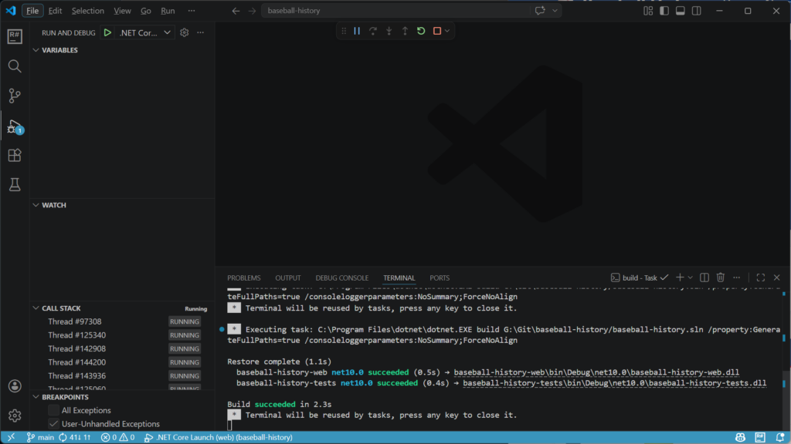

## **The Quiet Tax on Doing .NET in VS Code**

Here is the part nobody at Microsoft puts in a slide deck. The C# story in VS Code, even with C# Dev Kit, has always been the polite-but-shallow option. Rename works. Go-to-definition works. Build works. The basics behave. Then you ask for anything past the basics and you watch the seams come apart.

You want to extract an interface from a class. You can’t, really. You want to ctrl-click into a NuGet package’s source. You can’t. You want to move six classes out of one giant file. You can do it the manual way, with cut and paste, like you’re back in 2010. You want a real Solution Explorer. You get a tree that almost works the way Visual Studio’s does and then surprises you somewhere uncomfortable.

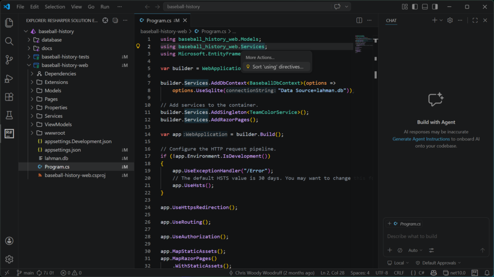

This was the tax. Every time I opened VS Code for a C# task, I paid it. Pair programming on a teammate’s Mac, peeking at a coworker’s pull request over coffee, working inside a dev container, an SSH session into a build box, a quick fix on a Linux laptop that will never see Visual Studio. All of those moments came with the same compromise. Reach for VS Code, accept that you are about to do half the job in twice the time, get on with it.

That tax is what got cheaper this year. Not gone. Cheaper.

## **What Actually Showed Up**

ReSharper for VS Code is the same engine that has been running in Visual Studio for two decades and powering Rider for ten years, packaged for VS Code and any compatible editor. It went through a public preview most of last year, and the official 2026.1 landed in early March 2026.

It runs in VS Code, Cursor, Google Antigravity, VSCodium, Windsurf, basically anything VS Code-compatible. It is on the Open VSX Registry now, so the Cursor and Codium crowd gets auto-updates rather than chasing VSIX downloads.

Free for non-commercial work, including learning, OSS contributions that don’t earn you money, content creation, and hobby projects. Paid licenses for commercial use, included in the regular ReSharper, dotUltimate, and All Products Pack subscriptions.

In practice, type “ReSharper” into the Extensions panel, click Install, and the right pieces land.

## **Why You’d Pick This Over C# Dev Kit**

C# Dev Kit is not bad. That is also the most generous thing I can say about it.

It is a perfectly serviceable answer to a question Microsoft mostly asked itself. JetBrains spent twenty years asking a harder version of the same question and shipping the answer in shorter loops. The gap shows.

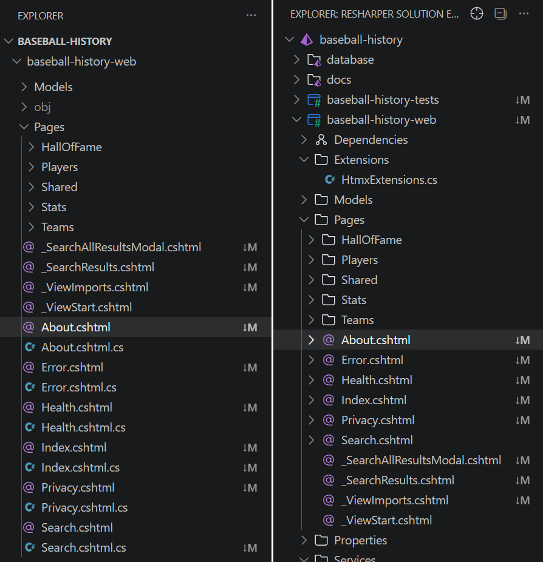

A few places the gap shows most:

**Inspections that earn their keep.** Roslyn catches what Roslyn catches. ReSharper catches the rest. The 2026.1 release added a wave of inspections focused on runtime safety issues. Short-lived HttpClient instances that will exhaust sockets. LINQ chains that quietly enumerate twice. `ImmutableArray<T>` initializations that compile fine and behave wrong at runtime. These are the bugs that ship to production and ruin a Friday.

**Navigation that works on code you don’t own.** Ctrl-click into a method that lives inside a NuGet package and ReSharper decompiles the assembly so you can read the actual implementation right there in the editor. C# Dev Kit cannot do this. If you have ever debugged a third-party library by guessing what it does, you already know how badly you want this feature.

**A real Solution Explorer.** Source generators visible in the tree. NuGet packages manageable in place. Project references where a .NET dev’s hand reaches for them. The same one Rider users already trust.

**Live templates and postfix completion.** Type the name of a collection, then a dot, then foreach, then Tab. You get a fully-formed loop with the iterator variable named correctly. Type any expression, dot, notnull, and ReSharper wraps it in a guard for you. The first week, this feels like a parlor trick. The second week, plain VS Code feels broken.

**Cross-editor consistency.** If you also work in Rider or full Visual Studio with ReSharper, your code style settings, your shortcuts, and your muscle memory all ride along.

One honest caveat before we go further. ReSharper does not yet ship its own debugger for VS Code. It is on the roadmap. Until it lands, you keep Microsoft’s C# extension installed and use vsdbg. The setup section below covers exactly how to wire that up.

## **The Features That Pay Back the Install in the First Hour**

**Inspections that show up the moment you open a file**

Open a project, watch the gutter start working. Most of what you see will be familiar style or correctness hints. Some of it won’t be. ReSharper flags an async method declared as returning void with a one-line explanation of why that pattern eats exceptions silently. It catches a LINQ chain that calls Count() inside a loop. It tells you when an `ImmutableArray<T>` got initialized in a way the runtime treats as the default value. Hit `Alt+Enter` (or `Cmd+.` on Mac) and the lightbulb usually has the fix queued and ready.

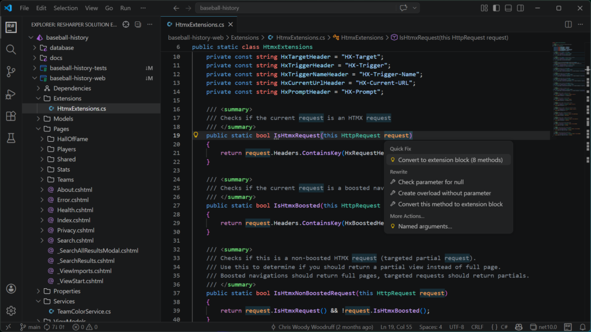

**Refactorings you would trust on a Friday afternoon**

Rename works across project boundaries, including in Razor and Blazor markup. Extract Method lifts the code, creates the new method, and rewrites the original code to implement it. Move Type to File takes the six classes you crammed into one .cs file and gives each one its own home without breaking references.

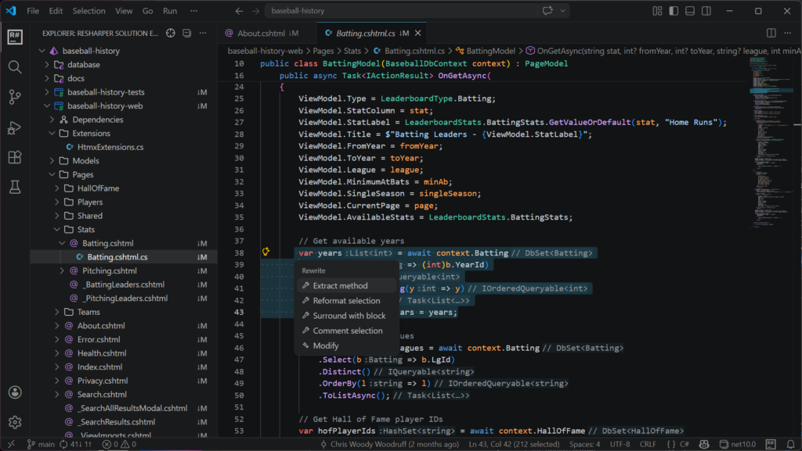

**Navigation, including into code you didn’t write**

Go to Everything (`Ctrl+T` on Windows, `Cmd+T` on Mac) is the best fuzzy-finder in the .NET tooling field. Types, files, symbols, all in one box. Go to Implementation on an interface declared inside a NuGet package drops you into a decompiled view of the actual implementation. Find Usages groups results by project, file, and usage kind, so you can scan a hundred-result list without your eyes glazing over.

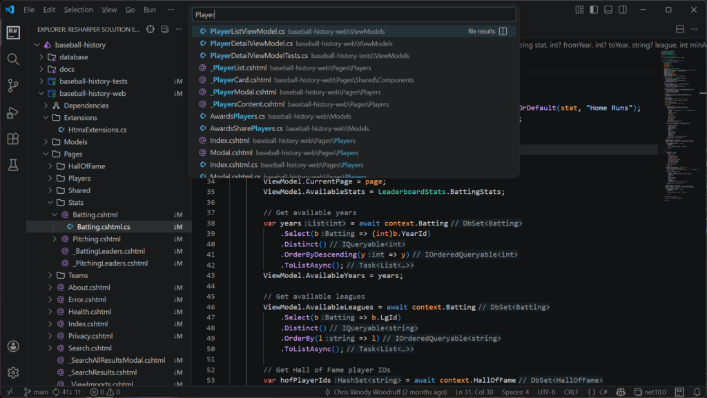

**A Solution Explorer that should have been there from day one**

Tree view of the solution, organized the way a .NET dev expects. Projects, dependencies, NuGet packages, source generators, all of it. Right-click for Add Project, Manage References, Manage NuGet. None of this was missing in C# Dev Kit, but it was rougher and a step or two slower at every interaction.

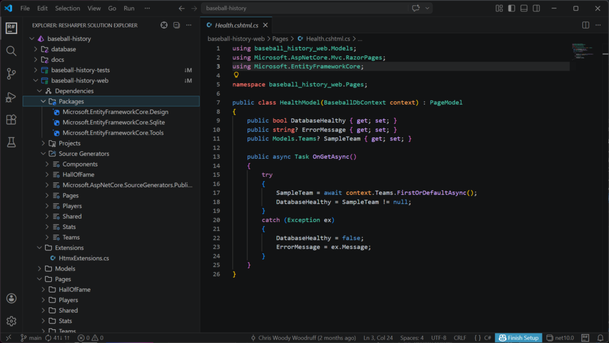

**Unit testing that finds your tests on its own**

NUnit, xUnit, and MSTest discovered automatically. Run from the gutter. Results in a panel. One click jumps from a failing test to the line that broke it. If you have used the test runner in Rider, this is the same one wearing a VS Code coat.

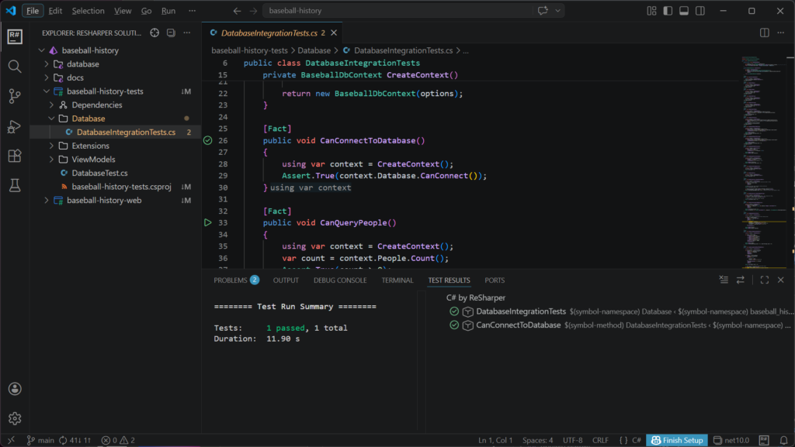

**Live templates and postfix completion (the secret weapon)**

The feature that turns ReSharper users into ReSharper missionaries. Type a collection name, dot, foreach, Tab, get a real loop with the iterator named for you. Postfix completion lets you type the expression first and the wrapper second. `someValue.notnull` becomes a null guard around someValue. someCollection.first becomes a `First()` call you can refine. Compounded over a workday, these save you hundreds of keystrokes you didn’t know you were spending.

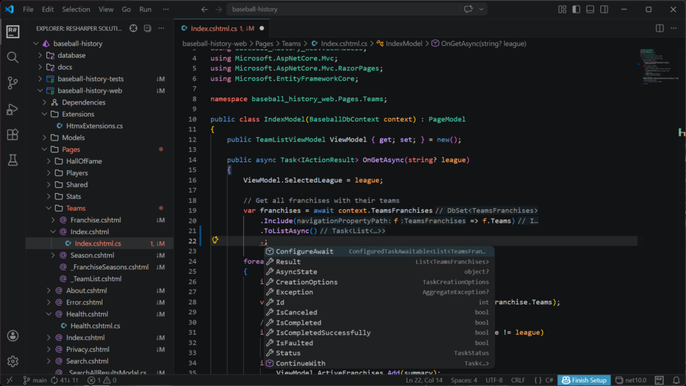

**The Setup: Five Minutes, Done Right**

This is where most blog posts hand-wave. Don’t skip this part. There is one specific combination of extensions that gets you the JetBrains experience without giving up F5, and another combination that fights itself for an hour.

**Install these:**

1.  **The ReSharper extension.** Search “ReSharper” in the VS Code Extensions panel and install. Same name on Open VSX if you are in Cursor or VSCodium.
2.  **The .NET SDK.** ReSharper assumes a working dotnet is on your PATH. Run `dotnet --info` in a terminal to confirm. If that command works, you are set.
3.  **The Microsoft C# extension** (ms-dotnettools.csharp). Keep this one. ReSharper does not yet ship its own debugger, and the Microsoft C# extension is what brings the coreclr debugger you need for ASP.NET Core, console apps, Blazor Server, and the rest.

**Switch off these:**

4.  **C# Dev Kit** (ms-dotnettools.csdevkit). JetBrains’ own getting-started page recommends turning it off while ReSharper is active, and the recommendation is correct. The two extensions overlap heavily on Solution Explorer, the test runner, and project templates. Run them both at once and you get duplicate squigglies, doubled inspections, and slower indexing. You can disable per workspace if you want to keep it around for projects where you’d rather use it.
5.  **IntelliCode for C# Dev Kit.** Switch off alongside the Dev Kit, for the same reason.

**The combination that works:** ReSharper on for the smart features. Microsoft C# extension on for the debugger. C# Dev Kit off. That is the lineup.

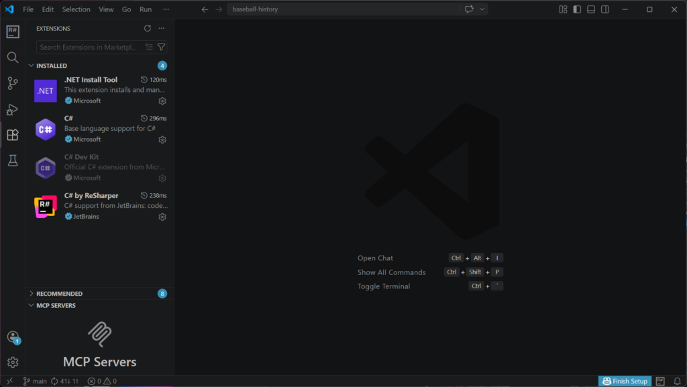

**One-time configuration:**

6.  **Open the workspace.** ReSharper auto-detects `.sln`, `.slnx,` `.slnf`, or a bare `.csproj`. If it finds more than one solution, it shows an Open Solution picker.
7.  **Let it index.** First open on a big solution takes a minute. After that, opens are quick.
8.  **launch.json for debugging.** The Microsoft C# extension will offer to generate one if you don’t already have it. The minimal ASP.NET Core configuration looks like this:

```json
{

  "name": ".NET Launch",

  "type": "coreclr",

  "request": "launch",

  "preLaunchTask": "build",

  "program": "${workspaceFolder}/bin/Debug/net9.0/YourApp.dll",

  "cwd": "${workspaceFolder}",

  "env": { "ASPNETCORE_ENVIRONMENT": "Development" },

  "serverReadyAction": {

    "action": "openExternally",

    "pattern": "\\bNow listening on:\\s+(https?://\\S+)"

  }

}
```

9.  Optional but worth doing. Open Settings, search “ReSharper,” and tune the inlay hints and inspection severity if the defaults feel too loud out of the gate.

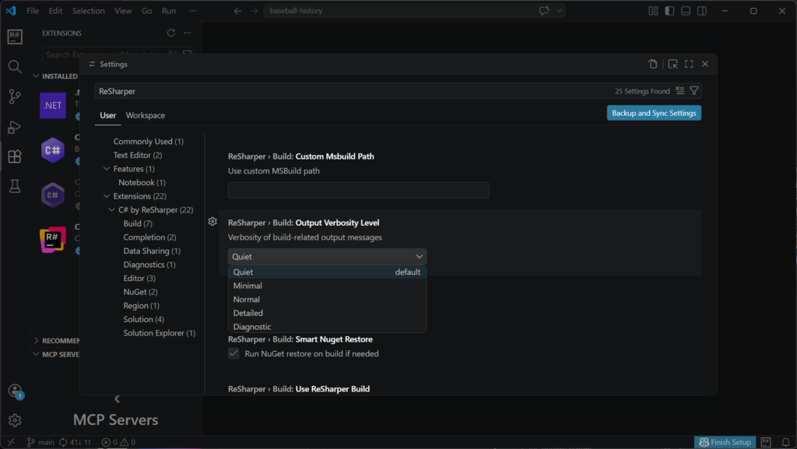

**Where to Go When You Want More**

If the install sticks for you, these are the bookmarks worth keeping:

-   The official docs at [jetbrains.com/help/resharper-vscode/.](https://www.jetbrains.com/help/resharper-vscode/Get_started.html) Surprisingly readable, with separate getting-started pages for VS Code, Cursor, and Antigravity.
-   The .NET Tools Blog at [blog.jetbrains.com/dotnet/](https://blog.jetbrains.com/dotnet/). Release notes are where the real feature deltas live.
-   Issue tracker and community forum, both linked from inside the extension. Click the R# icon, then Contact Support.
-   Keyboard shortcuts. If you are coming from Visual Studio with ReSharper or from Rider, install the JetBrains keymap for VS Code so `Ctrl+T`, `Alt+Enter`, and the rest behave the way your fingers remember.
-   Pricing at [jetbrains.com/resharper/buy/](https://www.jetbrains.com/resharper/buy). Free for non-commercial as said before, paid otherwise.

**A Tuesday That Actually Worked**

Last Tuesday I cloned a thirty-project ASP.NET Core monolith I had never seen before. The kind of repo that opens in Visual Studio with a coffee break attached. I was on a Linux laptop in a coffee shop, on hotel WiFi, and I needed to ship a small fix before standup.

I opened it in VS Code. Not because I wanted to. Because Visual Studio was not on the laptop, and never will be.

ReSharper indexed the solution in about ninety seconds. `Ctrl+T`, three letters of the controller name, landed on the file. `Ctrl+B` into the service it called. `Ctrl+B` again into a method that lived inside a NuGet package, decompiled in front of me, the bug staring up. Alt+Enter, Extract Method, write a test, F5 to run with the Microsoft debugger, breakpoint hit, fix verified, push the branch, PR up.

Twenty-two minutes. From a laptop that will never see Visual Studio.

That’s the case I want to make. I am not switching editors. Rider is still where I live. I am just glad that VS Code stopped being the place where I do half the work in twice the time. The tax is cheaper. The option is real. And the next time I am on a borrowed Mac at three minutes to standup, I know exactly what extension I am installing first.

***“I partnered with JetBrains to bring you this blog post, and I’m excited to share my honest experience.”***
