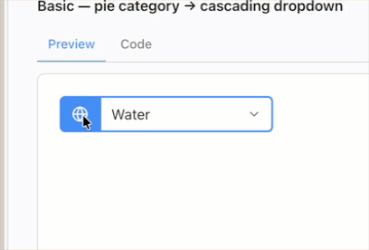
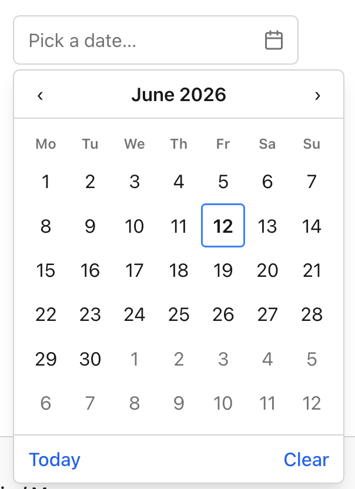
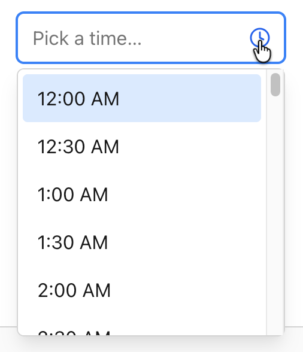
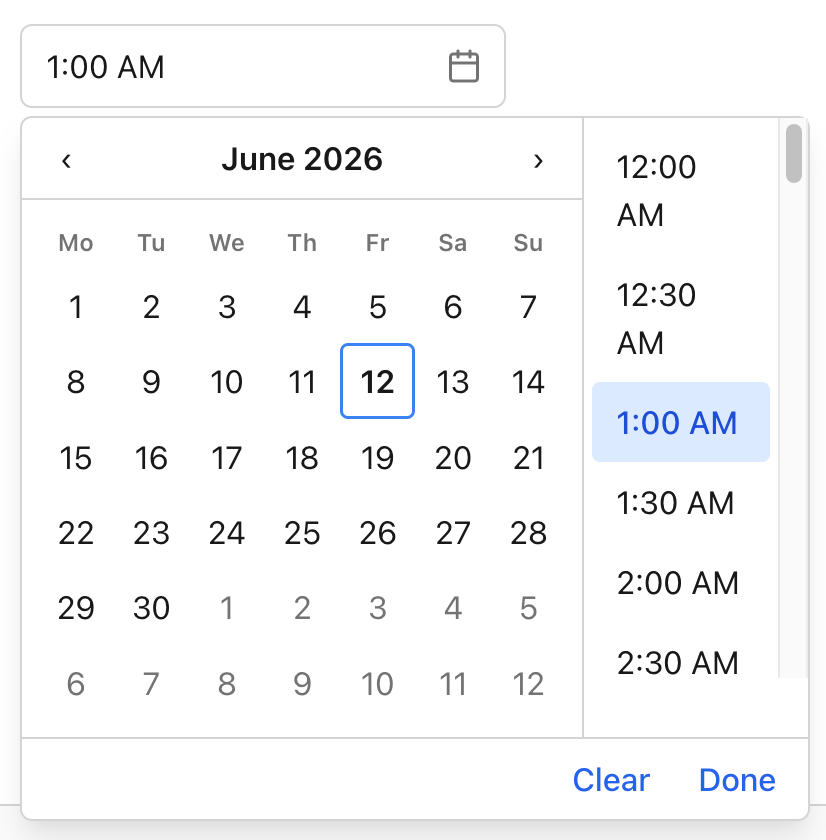

Forms are where server-rendered apps either feel sharp or feel clunky. A date field that drops you into a raw text box, a category selector that needs a client-side widget and three npm packages, a time field that accepts “2:74 pm” without complaint. Those are the rough edges that push teams toward heavy JavaScript pickers.

v2.1.0 closes those edges. This release adds a family of advanced input controls for ASP.NET Core, all server-rendered, all keyboard-accessible, and all driven by htmx with no client-side JS library required. It also brings the Playwright end-to-end suite back into CI, so every one of these controls is exercised in a real browser before it ships.

Here is what landed.

## Radial Select

Category pickers are usually a flat dropdown with thirty options and no visual grouping. Radial Select takes a different shape. A rectangular trigger opens a circular pie of wedges, each labeled with a color and icon, so the choice reads at a glance rather than as a wall of text.



Picking a wedge fires an htmx cascade: the server responds with the matching options for a second dropdown, and the first option is auto-selected so the field is never left half-filled. The whole control behaves as a menu for assistive tech, with arrow-key movement between wedges and Enter to commit.

```html
<rhx-radial-select asp-for="CategoryId"
                   hx-get="/catalog/subcategories"
                   hx-target="#subcategory"
                   wedge-icons="true">
    <rhx-radial-wedge value="hardware" label="Hardware" color="#6366f1" icon="cpu" />
    <rhx-radial-wedge value="software" label="Software" color="#10b981" icon="code" />
    <rhx-radial-wedge value="services" label="Services" color="#f59e0b" icon="wrench" />
    <rhx-radial-wedge value="support"  label="Support"  color="#94a3b8" icon="life-buoy" />
</rhx-radial-select>

<select id="subcategory" name="SubcategoryId"></select>
```

The trigger renders as a normal form control. The pie only mounts when opened, so the markup stays light and the cascade target is just a plain `<select>` the server repopulates.

## Date Picker

The Date Picker pairs a text input with a pop-up calendar. Month navigation is server-rendered, so the grid you see is the grid the server validated, and there is no parallel date math running in the browser to drift out of sync.



On selection, it commits a hidden ISO `yyyy-MM-dd` value, which means model binding just works against a `DateOnly` or `DateTime` property. You get `min` and `max` bounds, a configurable week start, and full APG grid keyboard support: arrow keys move by day, Page Up and Page Down move by month, Home and End jump to the week edges.

```html
<rhx-date-picker asp-for="StartDate"
                 min="2026-01-01"
                 max="2026-12-31"
                 week-start="Monday" />
```

```csharp
public class BookingModel
{
    [Required]
    public DateOnly StartDate { get; set; }
}
```

The hidden value is always ISO, so you are binding and validating against a canonical string regardless of how the date is displayed to the user.

## Time Picker

The Time Picker is a text input plus a pop-up list of selectable times. The list steps by the minute interval you set, so a scheduling form can offer 15-minute slots while a logging form offers single-minute intervals.



It commits a hidden ISO `HH:mm` value and displays in 12- or 24-hour format depending on configuration. The pop-up is a proper listbox: arrow keys move through times, and type-ahead lets a user jump by typing the start of a time.

```html
<rhx-time-picker asp-for="StartTime"
                 minute-step="15"
                 display-format="12h" />
```

Type “9” and the listbox jumps to nine o’clock. The bound value stays `HH:mm` no matter which display format you pick.

## Date & Time Picker

When a field really needs both halves, the Date & Time Picker pairs the calendar with the time list in a single `DateTime` control. It reuses the Date Picker calendar and the Time Picker list, so the behavior is identical to the standalone controls, just composed.



It holds its value back until both halves are set, then commits a single hidden ISO `yyyy-MM-ddTHH:mm` value. No partial `DateTime` ever reaches your model.

```html
<rhx-date-time-picker asp-for="Appointment"
                      min="2026-06-01T08:00"
                      max="2026-06-30T18:00"
                      minute-step="30"
                      week-start="Monday" />
```

```csharp
public class AppointmentModel
{
    [Required]
    public DateTime Appointment { get; set; }
}
```

One control, one bound property, one ISO value on submit.

## Playwright E2E back in CI

A picker that works on your machine and breaks in Safari is worse than no picker. So alongside these controls, the end-to-end suite is re-enabled and stabilized.

Chromium now runs on every pull request as a gate, and a full browser matrix runs nightly. That means keyboard navigation, the htmx cascade, calendar rendering, and value commits are all checked against real browser behavior before a change merges, not just against unit assertions. If a regression touches how these inputs behave for a real user, the suite catches it.

## Bug fixes

This release also folds in a handful of fixes reported by users since v2.0.0. Thanks to everyone who filed issues with repro steps. Those are the reports that turn into the fastest fixes.

## Getting v2.1.0

Update the package reference, and you are current. There are no breaking changes from v2.0.0, and the new controls target .NET 10.

```bash
dotnet add package htmxRazor --version 2.1.0
```

Full docs and live demos for each control are at [htmxRazor.com](https://htmxRazor.com), and the source is on [GitHub](https://github.com/cwoodruff/htmxRazor). If you build something with the new pickers, I would like to see it.
