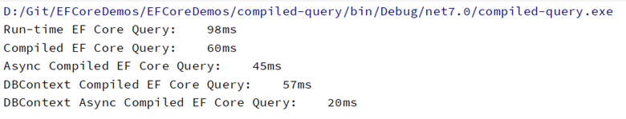

> We are surrounded by data, but starved for insights.
> 
> Jay Baer

One of my passions is data! I love all forms of data and how to work with it. I am a .NET fanatic also and have been a fan of Entity Framework since 2008. It has gotten so good since .NET Core 1.0, and I love to push EF Core to the limit, especially around Web APIs. In this blog post, I want to share my ideas about **Compiled Queries in EF Core**.

<!--more-->

## Queries in EF Core

Before we look at Compiled Queries in EF Core, let's examine the "normal" query most developers utilize in their .NET projects. Here is an example of such a query.

```csharp
public Album GetById(int id)
{
    var dbAlbum = _context.Albums.Find(id);
    return dbAlbum;
}
```

What happens in your application at runtime when using the query above?

- The query has to be built using the value from the id parameter of the GetById() method.

- The query is then compiled. This will be cached to save on JIT'ing the query everytime.

- Entity Framework builds the corresponding SQL SELECT statement for the query and sends that command to the SQL database.

- Entity Framework receives the results from the SQL database and hydrates the Album object based on the results.

- If found, the resulting Album object is returned, or a null is returned.

If this query is executed many times during the lifetime of the .NET program, it will become a performance issue to have the query compiled each time. This is where creating compiled queries using EF Core will be a benefit for your and your code.

## Compiled Queries in EF Core

Entities Framework Core (EF Core) 2.0 was the version where Compiled Queries was introduced. The 2.0 release of EF Core was stimulating for developers around performance because of not only compiled queries DBContext pooling and FromSql. Blog post around both of these other EF Core features coming soon.

A query is "compiled" when its SQL statement is generated and optimized at runtime. These queries can significantly boost performance, exceptionally when the same query gets executed multiple times. In EF Core, compiled queries are implemented using the **CompileQuery()** or **CompileQueryAsync()** method.

In my demos and testing, I will create the compiled queries in the code close to the execution and my favorite location: in the DBContext class. I find that allowing the compiled queries to be in the DBContext and using the AddDbContextPool method when adding the DBContext to the Dependency Injection container is crucial to my use of compiled queries. You can find that code in my [**Chinook7WebAPI\_CmpldQry**](https://github.com/cwoodruff/Chinook7WebAPI_CmpldQry) repo, while my tests to show the performance increase is in my [**compiled-query**](https://github.com/cwoodruff/EFCoreDemos/tree/main/EFCoreDemos/compiled-query) project that is part of my [**EFCoreDemos**](https://github.com/cwoodruff/EFCoreDemos) repo.

To use a compiled query, you first need to create a delegate that takes the input parameters for the query and returns the result. I also like to write a method on the DBContext class as a wrapper for the delegate. Here is an example of a compiled query that retrieves all customers from the database:

### Synchronous Compiled Query

```csharp
private static readonly Func<ChinookContext, IEnumerable<Album>> _queryGetAllAlbums = EF.CompileQuery((ChinookContext db) => db.Albums);

public IEnumerable<Album> GetAllAlbums() => _queryGetAllAlbums(this);
```

### Asynchronous Compiled Query

```csharp
private static readonly Func<ChinookContext, IAsyncEnumerable<Album>> _queryGetAllAlbumsAsync =
        EF.CompileAsyncQuery((ChinookContext db) => db.Albums);

public IAsyncEnumerable<Album> GetAllAlbumsAsync() => _queryGetAllAlbumsAsync(this);
```

Once you have created the delegate and the method in your DBContext, you can use it throughout your solution. Here is an example of how you might use **ChinookContext.GetAllAlbums()** method:

```csharp
using (var context = new ChinookContext())
{
    var customers = GetAllAlbums(context);
    foreach (var album in albums)
    {
        Console.WriteLine(album.Name);
    }
}
```

It's important to note that compiled queries are cached by default, so the SQL statement is only generated and optimized the first time the query is executed. This means that subsequent executions will be much faster.

The other important note regarding adding your compiled queries to your DBContext is that the queries will be cached when the DBContext is created. If you use the AddDbContext() method, your context will be created for each call that gets a context from the DI container. That is why it is essential to use the AddDbContextPool() method, which will create several contexts in a pool and allow your application to use one with the queries compiled for each use of the context from the DI container.

When you run the compiled-query EFCore demo, you will see the results of the different ways to use compiled queries. You can find the demo in my GitHub repo. [https://github.com/cwoodruff/EFCorePerfDemos](https://github.com/cwoodruff/EFCorePerfDemos)



## Drawbacks using Compiled Queries

Compiled queries can be helpful in situations where you need to execute the same query multiple times, and performance is a concern. However, it's essential to remember that they come with some trade-offs. For example, compiled queries can make debugging and testing your code more difficult since the SQL statement is generated at runtime. Additionally, they can make your code more complex and harder to understand.

## Conclusion

Overall, compiled queries are a powerful feature in EF Core that can help improve the performance of your data access code. However, as with any performance optimization, it's essential to use them judiciously and to consider the trade-offs involved.
