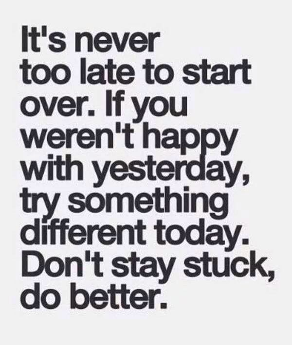

> It is never too late to be what you might have been.
> 
> George Eliot

Late blooming can refer to a person who has experienced a significant change or transformation in their life later on in their years. This change can come from a newfound passion, career, or even a new sense of self. For many late bloomers, this change can bring about a new sense of purpose and fulfillment and be a time of tremendous personal growth.

<!--more-->

For 50-year-old men who may have felt like they have not accomplished as much as they had hoped in their earlier years, becoming a late bloomer can be a time of reflection and reassessment. It's a time to take stock of where you are in your life and what you want to achieve moving forward. This can be a time to re-evaluate your priorities and make changes that better align with your goals and desires.

One of the keys to embracing a late blooming phase in life is to be open to change. This means being willing to take risks, try new things, and challenge yourself in ways you never thought possible. It can be a time to pursue hobbies or interests that you may have been too busy or too focused on other things to pursue in your earlier years.

Another key to embracing a late blooming phase is embracing growth and learning. Whether through formal education or simply by exploring new topics and ideas, continuous learning can be a great way to keep your mind active and engaged.

Finally, staying positive and surrounding yourself with supportive people is essential. Surrounding yourself with positive and supportive friends and family can help keep you motivated and on track and provide the encouragement you need to keep pushing forward.

In conclusion, being a 50-year-old late bloomer can be a time of significant personal growth and fulfillment. By embracing change, embracing growth and learning, and staying positive, you can make the most of this new chapter in your life. So if you feel like you've been a late bloomer, don't worry. Embrace it and make the most of the opportunities that come your way.
