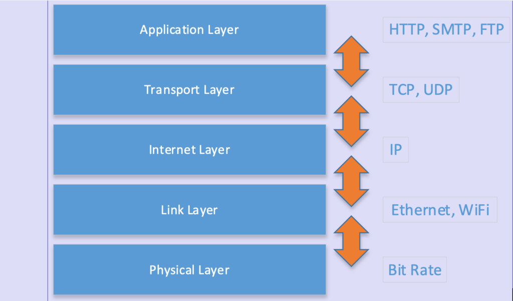

NOTE - This post is an example from the book **"Beyond Boundaries: Networking Programming with C# 12 and .NET 8"**. For a deeper dive into socket programming and more networking concepts, visit [https://csharp-networking.com/](https://csharp-networking.com/) or get your copy of the book on [Leanpub](https://leanpub.com/csharp-networking/).

When you send a text message, watch a video online, or even check your email, countless interactions happen behind the scenes to make it all work seamlessly. These interactions rely on **network protocols**—a set of rules that ensures devices can talk to each other, even if they're from completely different manufacturers or built for entirely different purposes.

Let's explore why network protocols are essential, how they work, and the magic they bring to the digital world.

## How Do Protocols Work?

Imagine you're sending a letter to a friend. You'd follow a process: write the letter, address the envelope, and drop it in the mail. Similarly, when data travels across a network, it follows several steps, each guided by a specific protocol:

1. **Addressing**: Before data can go anywhere, it needs an address. Protocols like **IP** (**Internet Protocol**) assign every device a unique identifier, ensuring the data knows precisely where to go.

3. **Packaging and Transport**: Data doesn't travel as one big blob. It's broken into smaller chunks called packets. Protocols like **TCP** (**Transmission Control Protocol**) ensure these packets are delivered in the correct order and without errors. Alternatively, protocols like **UDP** (**User Datagram Protocol**) prioritize speed over reliability, making them ideal for real-time applications like video streaming or online gaming.

5. **Application-Specific Rules**: Finally, the data interacts with the application using its specific protocol. For example:
    - **HTTP/HTTPS** ensures web browsers and servers can communicate effectively.
    
    - **SMTP** helps send emails.
    
    - **DNS** resolves user-friendly web addresses like [www.example.com](http://www.example.com/) into numerical IP addresses.

* * *

## Why So Many Protocols?

Not all data is created equal, and neither are its communication needs. For instance, watching a live video stream prioritizes speed over precision, so losing a tiny bit of data here and there is acceptable. On the other hand, sending an email or transferring a file demands absolute accuracy.

This is why different protocols exist for different tasks:

- **TCP** is like sending a package with a receipt. It guarantees the package arrives, and you'll know if it didn't.

- **UDP** is like shouting a quick message to someone across the room. It's fast, but it doesn't guarantee they'll hear every word.

- **FTP** (**File Transfer Protocol**) is the go-to for transferring files.

- **SMTP** (**Simple Mail Transfer Protocol**) handles sending emails, while **IMAP** and **POP3** manage receiving them.

- **DNS** acts as the Internet's phonebook, translating domain names into IP addresses.

Each protocol has a specific job, ensuring the Internet runs smoothly and efficiently.

* * *

## Why Should You Care About Protocols?

Understanding network protocols can be a game-changer, even if you're not a network engineer. Here's why:

- **Build Better Applications**: As a developer, understanding how protocols like HTTP, TCP, and UDP work can help you design faster, more efficient apps.

- **Troubleshoot Like a Pro**: Understanding the data flow helps you pinpoint issues, whether a slow-loading website or a misbehaving API.

- **Appreciate the Complexity**: The next time you stream a video or make a video call, you'll have a newfound respect for the layers of technology, making it all possible.

* * *

## The Layered Cake of Network Protocols: TCP/IP

The most common suite of network protocols, TCP/IP, is built like a layered cake. Each layer has a specific role, and they work together to ensure smooth communication:

1. **Application Layer**: Handles user-facing tasks. Protocols like HTTP, FTP, and DNS live here.

3. **Transport Layer**: Ensures data is delivered reliably (TCP) or quickly (UDP).

5. **Internet Layer**: Handles addressing and routing data with IP.

7. **Link Laye**r: Manages the physical connection between devices, like Ethernet or Wi-Fi.

9. **Physical Layer**: Manages communication between two devices by defining both the transmission medium and how data is transmitted.

This structure allows flexibility and scalability, making the Internet what it is today.

* * *

## Wrapping It Up

Network protocols are the unsung heroes of our digital age. They ensure that devices across the globe can communicate effectively, enabling everything from casual chats to critical data transfers. Understanding these protocols gives you insight into the mechanics of the Internet and equips you with the knowledge to build or troubleshoot networked systems.

So, the next time you load a webpage or stream a movie, take a moment to appreciate the invisible rules and conventions that make it all possible. Network protocols may not get the spotlight, but they are true connectivity champions.
