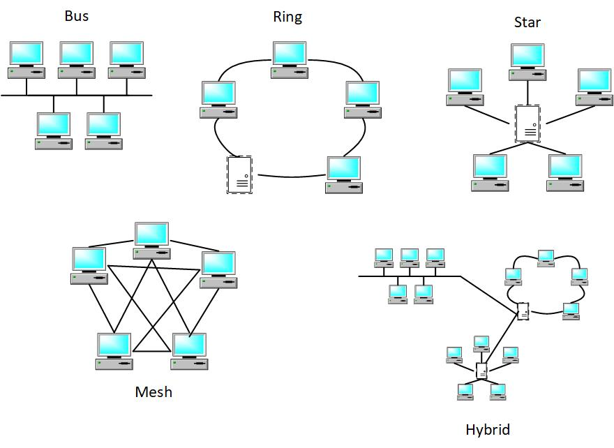

> ### NOTE - This post is an example from the book **"Beyond Boundaries: Networking Programming with C# 12 and .NET 8"**. For a deeper dive into socket programming and more networking concepts, visit [https://csharp-networking.com/](https://csharp-networking.com/) or get your copy of the book on [Leanpub](https://leanpub.com/csharp-networking/).

When you send an email, stream a video, or check a social media feed, it's easy to take how that data travels to you for granted. Behind the scenes, an intricate system of routing and network topologies ensures that everything arrives where it's supposed to—fast and error-free. Let's pull back the curtain and take a closer look at how data navigates the digital highways and the role that topologies play in shaping those pathways.

## What Is Routing?

Imagine you're driving to a new destination in a bustling city. You rely on a GPS to guide you through traffic, avoid closed roads, and get you there efficiently. Routing works much the same way, except the travelers are data packets, and the "GPS" is a combination of algorithms and network devices.

Routing is the process of directing data packets from a source (say, your computer) to a destination (a server or another computer). Routers act as traffic controllers, analyzing each data packet's destination and deciding the best path to take.

Here's why routing is so important:

- **Efficiency**: It ensures that data takes the shortest, least congested route.

- **Reliability**: Routers can find alternative routes if one path is blocked (due to a device failure, for example).

- **Scalability**: It allows networks of all sizes—from small home networks to the vast internet—to function seamlessly.

Static vs. Dynamic Routing

Routing decisions don't happen by magic. They're based on two main strategies: static and dynamic routing.

- **Static Routing**: Think of this as having a fixed map. Network administrators manually configure routes on each router. This method works well for small, stable networks but can become a nightmare for larger or frequently changing ones. If a route breaks, someone has to update it manually.

- **Dynamic Routing**: This is the GPS of routing. Routers share information about network changes and calculate the best routes in real-time. Dynamic routing protocols, like OSPF (Open Shortest Path First) or BGP (Border Gateway Protocol), make networks adaptive and resilient. If a link fails, these protocols quickly find an alternative path.

Dynamic routing is the go-to choice for larger, more complex networks because of its flexibility and efficiency.

## Understanding Network Topologies

Now that we've covered how data moves, let's talk about the roads themselves—network topologies. These are the layouts or designs of how devices connect in a network. Each topology has its own strengths and weaknesses, much like different city layouts.

Here's a quick tour of the most common network topologies:

1. **Bus Topology**: Picture a single main road with houses connected along it. In a bus topology, all devices are connected to one central cable.
    - **Pros**: Simple and cost-effective for small networks.
    
    - **Cons**: If the main cable fails, the entire network goes down.

3. **Star Topology**: Think of this as a hub-and-spoke model. A central hub connects directly to all devices.
    - **Pros**: Easy to manage, and if one device fails, it doesn't affect the rest of the network.
    
    - **Cons**: The hub is a single point of failure—if it goes down, so does the network.

5. **Ring Topology**: Devices form a closed loop, like cars driving on a circular road. Data travels in one direction around the ring.
    - **Pros**: Simple to troubleshoot, and data flows predictably.
    
    - **Cons**: A single break in the loop can disrupt the entire network.

7. **Mesh Topology**: This is the gold standard for redundancy. Every device is connected to every other device, creating multiple paths for data.
    - **Pros**: Highly fault-tolerant and reliable.
    
    - **Cons**: Expensive and complex to set up.

9. **Hybrid Topology**: A combination of two or more topologies. For example, a mix of star and bus designs.
    - **Pros**: Flexible and adaptable to different needs.
    
    - **Cons**: Can be complex to manage and design.

The choice of topology depends on the network's size, budget, and fault-tolerance needs.

## How Routing and Topologies Work Together

Think of routing and topologies as two sides of the same coin. The topology defines the physical and logical layout of the network, while routing determines how data navigates within that layout.

For example:

- In a **star topology**, the central hub might act as a router, directing data between devices.

- In a **mesh topology**, routers ensure that data takes the most efficient path out of the many available.

They shape how networks function together, ensuring data moves smoothly from point A to point B.

## Why It All Matters

Understanding routing and topologies isn't just for network engineers. If you've ever wondered why your video call lags or why some networks are faster than others, these concepts hold the answer.

Routing ensures data gets where it needs to go, while topologies determine how devices connect and interact. Together, they create the backbone of our connected world. Whether you're designing a new network, troubleshooting issues, or just curious how it all works, mastering these concepts is a step toward navigating the digital highways like a pro.

So, the next time you stream a movie or send a file, take a moment to appreciate the intricate dance of routers and topologies working behind the scenes to make it all happen. It's a modern marvel, and now you're one step closer to understanding how it all works.
