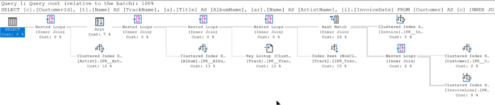
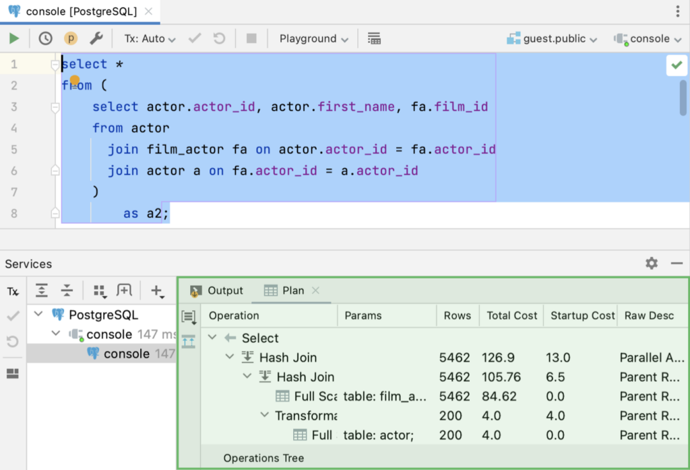

Ever tried reading a treasure map that looks more like a kid’s doodle? That’s what SQL query plans feel like at first glance—cryptic, overwhelming, and maybe a little intimidating. But don’t worry! Once you embark on the journey to analyze and understand query plans, you’ll be unlocking hidden performance treasures like a true database pirate, and you'll be amazed at how much you can grow and learn in the process.

Let’s dive into the world of query plans, break down what they mean, and learn how to use them to optimize your EF Core queries.

* * *

## **What is a Query Plan?**

A **query plan** is like a GPS for your SQL query. It shows your database engine's route to retrieve your data, including every join, filter, and sort operation.

The goal? To understand where your query might be taking unnecessary detours and make it faster, smoother, and more efficient.

* * *

## **Why Should You Care About Query Plans?**

Here’s why query plans are worth your time:

1. **Find Bottlenecks**  
    Query plans highlight expensive operations, like table scans or overly complex joins.

3. **Improve Performance**  
    Understanding the plan helps you rewrite queries or tweak your schema to make things faster.

5. **Show Off Your Nerd Skills**  
    Knowing your way around a query plan makes you the database hero your team didn’t know they needed.

* * *

## **How to Get a Query Plan**

You must get your hands on one before you can analyze a query plan. Here’s how:

### Using SQL Server Management Studio

To view a **query execution plan** in **SQL Server Management Studio (SSMS)**, simply open a new query window, write your SQL query, and click on the **"Include Actual Execution Plan"** button in the toolbar (or press **Ctrl + M**). Then, execute your query by pressing **F5**. After the query runs, you'll see the **execution plan tab** alongside your results. This visual plan shows how SQL Server processed your query, including details like **index usage, join types, and cost percentages** for each operation. It's a powerful tool for identifying performance bottlenecks and optimizing queries.



### Using JetBrains Rider

To view a **query execution plan** in a **JetBrains IDE** like **Rider**, first connect to your SQL Server database using the built-in **Database** tool window. Write your SQL query in the query console, then right-click anywhere in the query editor and select **"Explain Plan"** or click the **"Explain Plan"** button (usually represented by an execution plan icon in the toolbar). Rider will generate a **visual execution plan**, showing details like **index usage, join operations, and cost distribution** for each query step. This helps you analyze performance issues and optimize your queries efficiently.



* * *

## **Decoding the Query Plan**

At first glance, query plans look like a wall of text or a confusing diagram. Here’s how to break it down:

### 1\. **Identify the Starting Point**

Every query plan starts with the root operation, usually a `SELECT`. Trace the flow from top to bottom or left to right, depending on the tool.

### 2\. **Look for Scans**

- **Table Scan:** Reads every row in a table. Bad news for performance.

- **Index Scan:** Reads data via an index. Better, but it can still be slow for large datasets.

- **Index Seek:** The gold standard! Finds specific rows using an index, like a librarian with a Dewey Decimal number.

### 3\. **Check the Joins**

Joins can be performance killers. Look for:

- **Nested Loops:** Good for small datasets but can slow down with large ones.

- **Hash Joins:** Better for larger datasets.

- **Merge Joins:** Great for sorted data.

### 4\. **Sort and Filter Operations**

Sorting and filtering can be expensive. If they show up frequently, consider:

- Indexes are added to the columns being sorted or filtered.

- Reviewing the query to see if the sort is necessary.

* * *

## **Common Performance Killers and Fixes**

Here are some common issues you might spot in a query plan and how to fix them:

### **Problem 1: Table Scans**

_What it means:_ The database reads every row in the table.  
_Fix:_ Add an index to the column(s) being queried.

### **Problem 2: Missing Index Warnings**

_What it means:_ The database is hinting you could speed things up with an index.  
_Fix:_ Listen to it! Add the suggested index.

### **Problem 3: Expensive Sorts**

_What it means:_ The database is sorting a ton of rows.  
_Fix:_ Add an index to the sorted column or sort less data by filtering first.

### **Problem 4: Too Many Joins**

_What it means:_ Your query is juggling a lot of relationships.  
_Fix:_ Consider splitting the query into smaller, simpler ones.

* * *

## **How EF Core Queries Affect Query Plans**

EF Core generates SQL queries based on your LINQ expressions, but those LINQ queries can sometimes be… inefficient. For example:

### Inefficient LINQ

```csharp
var users = context.Users
    .Where(u => u.IsActive)
    .ToList()
    .OrderBy(u => u.LastName);
```

This pulls all active users into memory and then sorts them.

### Efficient LINQ

```csharp
var users = context.Users
    .Where(u => u.IsActive)
    .OrderBy(u => u.LastName)
    .ToList();
```

This pushes the sorting to the database, reducing memory usage and query time.

Always test how your LINQ translates into SQL, and adjust your queries for better plans.

* * *

## **Tools to Help Analyze Query Plans**

Here are some tools to make your life easier:

- **SQL Server Management Studio:** View graphical query plans.

- **JetBrains DataGrip:** View graphical query plans.

- **PostgreSQL’s EXPLAIN Tool:** Provides text-based query plans.

- **EF Core Logging:** Helps you trace SQL directly from your application.

* * *

## **Wrap-Up: Decode the Mystery**

Query plans might seem daunting, but they become a treasure map to better performance with a bit of practice. Whether spotting bottlenecks, tuning indexes, or rewriting queries, understanding query plans will make you the Sherlock Holmes of your database.

So, grab your magnifying glass and start investigating those queries. Your app (and your DBA) will thank you.
