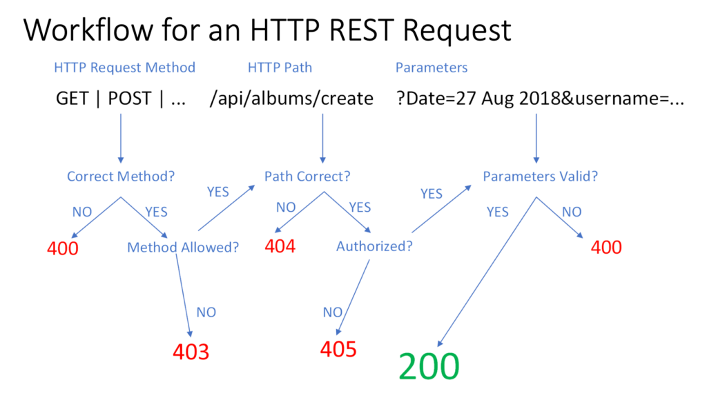

A well-designed REST API isn’t just a random collection of endpoints—it follows a set of principles that make it predictable, scalable, and easy to use. One of the core constraints of REST is the **Uniform Interface**. This principle ensures that APIs are structured consistently, reducing complexity for both developers and systems interacting with them.

But what exactly does that mean, and why should you care? Let’s break it down.

## What is a Uniform Interface?

In simple terms, a **Uniform Interface** means that every resource in a REST API follows a standard, predictable structure. The API uses:

- **Consistent URLs** to identify resources.

- **Standard HTTP methods** to interact with those resources.

- **Self-descriptive messages** that provide all the information needed to process a request.

- **Hypermedia (HATEOAS)** to guide clients through available actions.

The goal? Make APIs easy to understand and use—whether you’re a first-time consumer or an experienced developer integrating multiple services.

## Why It Matters

A uniform interface makes RESTful APIs:

- **Easier to Learn** – Developers don’t have to memorize different patterns for different resources.

- **Predictable** – Knowing the structure of one part of an API means you can guess the structure of another.

- **Interoperable** – Different clients (browsers, mobile apps, IoT devices) can interact with the API similarly.

Without a uniform interface, APIs become inconsistent, hard to navigate, and a nightmare to maintain.

## Key Principles of a Uniform Interface

### 1\. Resource Identification: Keep URLs Simple & Predictable

Each resource in a REST API should have a **unique, consistent URL**.

#### Example:

```
GET /api/products
GET /api/products/42
```

- `/api/products` → Retrieves all products.

- `/api/products/42` → Retrieves the product with ID 42.

Why this works:

- URLs should represent **nouns** (resources), not **verbs** (actions).

- Keeping URLs consistent improves discoverability and usability.



### 2\. Manipulation of Resources Through Representations

Clients don’t directly interact with resources—they send **representations** (usually JSON or XML) to modify them.

#### Example:

```
PUT /api/products/42
Content-Type: application/json

{
  "name": "Updated Product",
  "price": 99.99
}
```

This request updates product 42 with new details. The API processes the JSON and modifies the resource accordingly.

Key points:

- **Standard HTTP methods** (`GET`, `POST`, `PUT`, `DELETE`) define operations.

- Clients send structured data (JSON, XML) to modify resources.

- The API should respond with a clear status code (`200 OK`, `201 Created`, etc.).

### 3\. Self-Descriptive Messages: All the Information in One Request

Every request should include enough information for the server to process it, without relying on previous interactions.

#### Example:

```
GET /api/orders/123
Accept: application/json
```

And the response:

```
HTTP/1.1 200 OK
Content-Type: application/json

{
  "id": 123,
  "status": "shipped",
  "items": [
    { "product": "Laptop", "quantity": 1 }
  ]
}
```

Why this matters:

- The `Accept` header tells the server what format the client expects.

- The response includes `Content-Type`, so the client knows how to parse it.

- APIs should **never assume** the client has prior knowledge.

### 4\. HATEOAS: Guiding Clients with Hypermedia

Hypermedia as the Engine of Application State (HATEOAS) means that APIs **guide** clients by providing links to related actions.

#### Example Response:

```
{
  "id": 42,
  "name": "Green Sneakers",
  "links": {
    "update": "/api/products/42",
    "delete": "/api/products/42",
    "related": "/api/products?category=shoes"
  }
}
```

The API response doesn’t just return data—it **tells the client what actions it can take next**. This improves discoverability and keeps clients loosely coupled to the API’s structure.

## Examples in Practice

### 1\. Simple Endpoint Design

A RESTful API should use clean, structured URLs that follow a pattern:

```
GET /api/users
GET /api/users/5
POST /api/users
PUT /api/users/5
DELETE /api/users/5
```

A well-structured API follows this pattern across all resources—making it easy to learn and use.

### 2\. Improved Developer Experience

A uniform interface makes it easier for developers to work with APIs:

- Faster onboarding: Developers can understand endpoints without digging through documentation.

- Consistency: If `GET /users/5` works one way, `GET /products/5` should work the same.

- Debugging: Issues are easier to diagnose when APIs follow predictable patterns.

## Common Pitfalls to Avoid

### 1\. Overloading Endpoints

Bad example:

```
GET /api/userActions?task=delete&id=5
```

- This mixes multiple responsibilities (retrieving and deleting) into one endpoint.

- Instead, use:`DELETE /api/users/5`Each resource should have a **clear, single purpose**.

### 2\. Ignoring Content Negotiation

Bad practice:

- Always returning JSON, even when the client requests XML.

- Ignoring the `Accept` header.

Good practice:

```
GET /api/products/42
Accept: application/xml
```

The API should respond with XML if it supports it:

```
HTTP/1.1 200 OK
Content-Type: application/xml
```

REST APIs should respect client preferences to improve interoperability.

## Conclusion

The **Uniform Interface** is a fundamental REST constraint that ensures APIs are **predictable, consistent, and easy to use**. By following its principles—resource identification, representation-based manipulation, self-descriptive messages, and hypermedia—developers create APIs that are scalable and developer-friendly.
