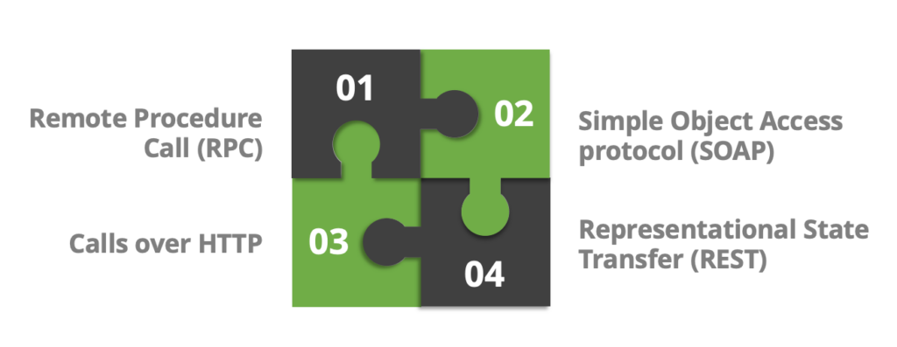

The internet runs on a lot of things—electricity, servers, cat videos—but when it comes to how web applications communicate, REST has been leading the way for over two decades. But where did REST come from? And how did it go from an academic concept to powering the world’s most significant web services? Let’s dive into the origin and evolution of REST.

* * *

## The Roy Fielding Effect: Where It All Began

The story of REST starts in the late 1990s with **Roy Fielding**, a computer scientist and one of the key architects behind HTTP. While working on his Ph.D. dissertation at the University of California, Irvine, Fielding explored ways to design scalable, distributed systems that leveraged the web’s existing architecture.

In 2000, he introduced the term **Representational State Transfer (REST)** in his dissertation, outlining a set of principles for designing networked applications. Instead of relying on complex, rigid protocols (like SOAP and RPC), REST proposed a more flexible and scalable way to interact with resources using standard HTTP methods like `GET`, `POST`, `PUT`, and `DELETE`.

Fielding wasn’t just writing about REST—he was actively shaping the Internet’s foundational protocols. His work influenced **HTTP/1.1**, which incorporated many of the ideas that made REST so powerful.

* * *

## REST Takes Over: A Timeline of Adoption

At first, REST was mainly an academic idea, but developers quickly realized it was a better approach for building APIs as the web grew. Here’s how it went mainstream:

### **Early 2000s: REST vs. SOAP**

In the early 2000s, **SOAP (Simple Object Access Protocol)** was the dominant web service standard. SOAP required XML-based messaging, strict contracts, and heavyweight processing. Conversely, REST was lightweight, flexible, and worked naturally with the web’s existing infrastructure.

### **Mid-2000s: RESTful APIs Emerge**

Companies started adopting REST for APIs, especially as web applications and mobile apps became more common. Instead of forcing clients to parse XML, REST APIs returned **JSON**, a lightweight and easy-to-parse data format.

### **Late 2000s – Early 2010s: The REST Boom**

By this time, RESTful APIs had become the standard for web services. Major companies like **Twitter, Facebook, GitHub, and Google** built their APIs using REST, allowing developers to interact with their platforms easily.

### **Today: REST is Everywhere**

While newer technologies like GraphQL and gRPC have emerged, REST remains the dominant API standard. RESTful APIs are the backbone of web and mobile development, from startups to enterprise applications.

* * *

## Why REST Became the Standard

REST wasn’t just another buzzword—it solved real problems. Here’s why it took over:

- **Simplicity** – REST APIs use URLs and standard HTTP methods, making them easy to understand and implement.

- **Flexibility** – Clients and servers can communicate without being tightly coupled.

- **Leverages HTTP** – REST doesn’t reinvent the wheel; it uses existing web standards like caching, authentication, and statelessness.

- **Scalability** – Since REST APIs are stateless, they scale well in distributed systems.

* * *

## REST in the Real World: Modern Examples

Some of the most widely used public APIs follow REST principles:

- **Twitter API** – Allows developers to fetch tweets, post content, and interact with user data.

- **GitHub API** – Used to manage repositories, issues, and user authentication.

- **Stripe API** – Powers payments for thousands of online businesses.

- **Spotify API** – Lets developers access music data, create playlists, and control playback.

While many of these companies have evolved their APIs with additional features (some using GraphQL), REST remains a core part of their architecture.

* * *

## Conclusion

REST started as an academic concept but quickly became the foundation of web communication. Its simplicity, scalability, and ability to work with the web’s existing structure made it the clear choice for API design. Even as new technologies emerge, REST remains the default for modern web services—and it’s not going anywhere anytime soon.
