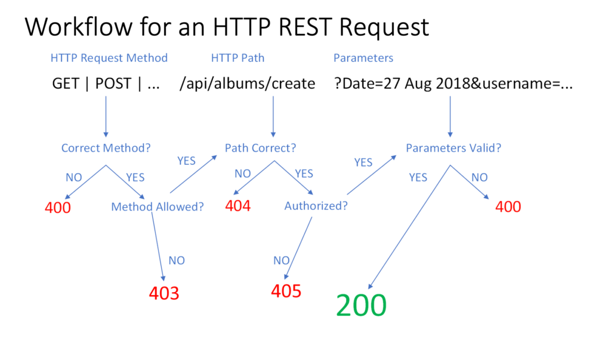

APIs are the backbone of modern applications, and getting their design right can mean the difference between an easy-to-use system and a frustrating mess. That’s where REST (Representational State Transfer) comes in. RESTful API design focuses on simplicity, scalability, and a resource-oriented approach that makes APIs intuitive and robust. Let’s explain why REST improves API design and helps developers build better systems.

## Resource-Oriented: Focus on Nouns, Not Verbs

One of REST's most significant advantages is that it organizes APIs around resources, not actions. URLs should represent **things** (nouns) rather than **operations** (verbs).

### Example: A Product Catalog API

- **Good RESTful Design:**
    - `GET /products` → Retrieve a list of products.
    
    - `GET /products/81` → Retrieve details about a specific product.
    
    - `POST /products` → Add a new product.
    
    - `PUT /products/81` → Update an existing product.
    
    - `DELETE /products/81` → Remove a product.

- **Bad Design (Action-Based URLs):**
    - `GET /getAllProducts`
    
    - `POST /createNewProduct`
    
    - `DELETE /removeProduct?id=81`

The RESTful approach makes APIs cleaner, more predictable, and easier to use. It also aligns with how the web naturally works.

## State Transfers: Guiding Users Through the Application

REST isn’t just about fetching data; it’s about **navigating an application’s state**. Each response should include the data requested and relevant links to other actions the client might need next. This concept is known as **HATEOAS (Hypermedia as the Engine of Application State)**.

### Example: Retrieving a Product

#### Request:

```
GET /products/81 HTTP/1.1
Host: api.example.com
```

#### Response:

```
HTTP/1.1 200 OK
Content-Type: application/json

{
  "id": 81,
  "name": "Green Sneakers",
  "color": "green",
  "price": 59.99,
  "links": {
    "update": "/products/81",
    "delete": "/products/81",
    "similar": "/products?color=green"
  }
}
```

The response not only provides product details but also suggests related actions through hyperlinks, guiding the client toward the next steps dynamically.

## Uniform Interface: Consistency is Key

REST APIs follow a **uniform interface**, making them easy to understand and use. The key elements of this approach include:

1. **Consistent URL Structure**
    - Logical URLs should identify resources (`/users/123`, `/orders/567`).
    
    - Filtering and queries should use standard parameters (`/products?color=green`).

3. **Standard HTTP Methods for CRUD Operations**
    - `GET` → Retrieve data.
    
    - `POST` → Create new data.
    
    - `PUT` → Update existing data.
    
    - `DELETE` → Remove data.

5. **Standard Response Codes**
    - `200 OK` → Successful request.
    
    - `201 Created` → Resource successfully created.
    
    - `204 No Content` → Resource successfully updated or deleted.
    
    - `304 Not Modified` → Resource was not updated due to the same state given.
    
    - `400 Bad Request` → Invalid input.
    
    - `403 Forbidden` → Requested method for resource not allowed.
    
    - `404 Not Found` → Requested resource doesn’t exist.
    
    - `405 Method Not Allowed` → The client is not authorized to access this method or API.
    
    - `500 Internal Server Error` → Something went wrong on the server.

By sticking to these conventions, RESTful APIs ensure a predictable and developer-friendly experience.

Below is the process I use when thinking about creating new RESTful APIs. It follows a logic review, ensuring I respond with the best HTTP response code.



## Loose Coupling: Independence Between Client and Server

A well-designed REST API allows the **client and server to evolve separately**. As long as the API’s resource structure and responses remain consistent, changes can be made independently.

### Why This Matters:

- A mobile app consuming a REST API doesn’t need to be rewritten every time the backend is updated.

- A frontend team can build new features without waiting for backend changes.

- Different clients (web, mobile, IoT devices) can seamlessly interact with the same API.

This flexibility is a huge advantage, especially for large applications that need to scale and adapt over time.

## Conclusion

REST improves API design by focusing on **clarity, consistency, and scalability**. It structures APIs around resources, provides a uniform way to interact with data, and keeps the client and server loosely coupled for long-term flexibility. By following RESTful principles, developers can build APIs that are easier to use, maintain, and scale—making everyone’s lives a little bit simpler.
