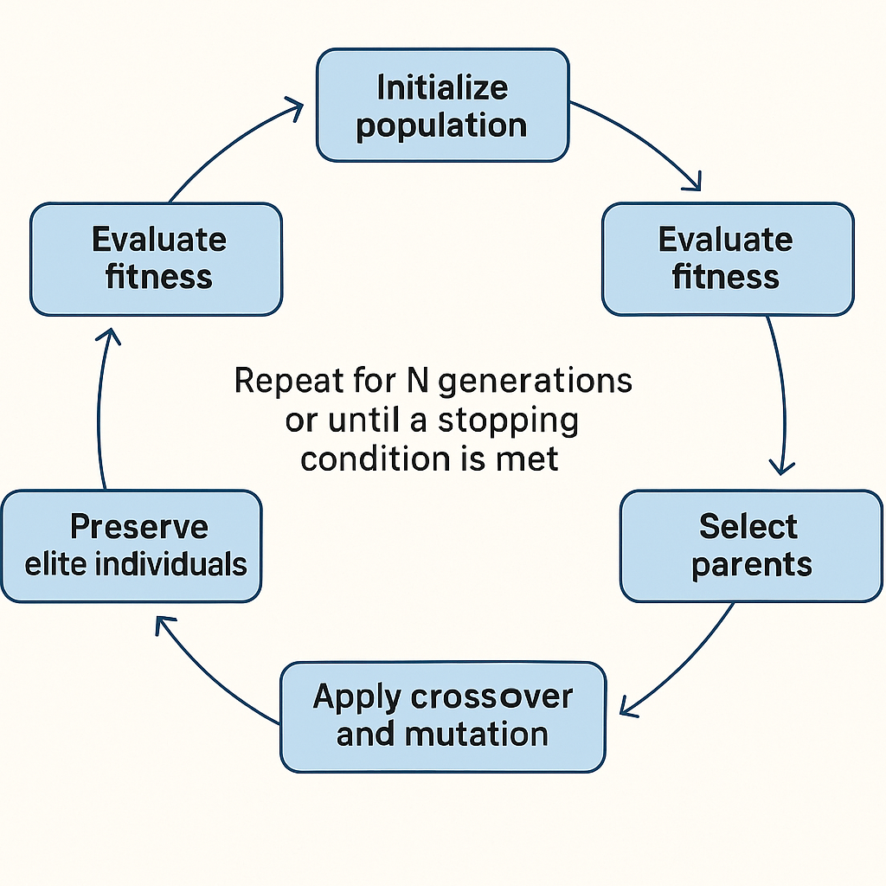

A genetic algorithm is only as effective as the loop that drives it. While selection, crossover, mutation, and elitism form the backbone of a genetic algorithm (GA), it is the configuration of the **evolution loop** that determines how the algorithm behaves over time.

Today’s focus is on designing and implementing the loop that runs your genetic algorithm. We will examine how to parameterize the loop with values such as population size, mutation rate, elite count, and maximum generations, and how to structure your logic to support reusable, testable, and adaptable evolutionary flows in C#.

## The GA Loop Structure

At a high level, every GA loop looks like this:

1. Initialize population

3. Evaluate fitness

5. Select parents

7. Apply crossover and mutation

9. Preserve elite individuals

11. Replace the old population with the new

13. Repeat for N generations or until a stopping condition is met

By exposing configuration options and encapsulating the loop logic, we can create a flexible engine that adapts to multiple problem domains.



## Configuration Parameters

Before implementing the loop, define your key GA parameters:

```csharp
public class GAConfig
{
    public int PopulationSize { get; set; } = 100;
    public int MaxGenerations { get; set; } = 500;
    public double MutationRate { get; set; } = 0.01;
    public int EliteCount { get; set; } = 2;
    public string Target { get; set; } = "HELLO WORLD";
}
```

This `GAConfig` class allows you to configure your algorithm externally or via a UI or script.

## Setting Up the Evolution Engine

Let’s encapsulate the core evolutionary logic into a method:

```csharp
public class GeneticAlgorithm
{
    private readonly GAConfig _config;

    public GeneticAlgorithm(GAConfig config)
    {
        _config = config;
    }

    public Chromosome Run()
    {
        var population = InitializePopulation();

        for (int generation = 0; generation < _config.MaxGenerations; generation++)
        {
            EvaluatePopulation(population);

            var best = population.OrderByDescending(c => c.FitnessScore).First();
            Console.WriteLine($"Gen {generation}: {best} (Fitness: {best.FitnessScore})");

            if (best.FitnessScore == _config.Target.Length)
                return best;

            population = Evolve(population);
        }

        return population.OrderByDescending(c => c.FitnessScore).First();
    }

    private List<Chromosome> InitializePopulation()
    {
        return Enumerable.Range(0, _config.PopulationSize)
                         .Select(_ => new Chromosome(_config.Target.Length))
                         .ToList();
    }

    private void EvaluatePopulation(List<Chromosome> population)
    {
        foreach (var c in population)
        {
            c.FitnessScore = c.GetFitness(_config.Target);
        }
    }

    private List<Chromosome> Evolve(List<Chromosome> current)
    {
        var nextGen = new List<Chromosome>();
        var elites = current.OrderByDescending(c => c.FitnessScore)
                            .Take(_config.EliteCount)
                            .Select(c => new Chromosome((char[])c.Genes.Clone()))
                            .ToList();

        nextGen.AddRange(elites);

        while (nextGen.Count < _config.PopulationSize)
        {
            var parent1 = TournamentSelection(current, 5);
            var parent2 = TournamentSelection(current, 5);

            var child = parent1.UniformCrossover(parent2);
            child.Mutate(_config.MutationRate);
            nextGen.Add(child);
        }

        return nextGen;
    }

    private Chromosome TournamentSelection(List<Chromosome> population, int size)
    {
        var group = population.OrderBy(_ => Guid.NewGuid()).Take(size);
        return group.OrderByDescending(c => c.FitnessScore).First();
    }
}
```

## Tuning the Parameters

| Parameter | Role | Typical Range |
| --- | --- | --- |
| PopulationSize | Number of chromosomes per generation | 50–500 depending on problem size |
| MaxGenerations | Limits evolutionary time | 100–1000 or more |
| MutationRate | Controls variation injection | 0.005–0.05 |
| EliteCount | Preserves top individuals per generation | 1–5 for small populations |

Experiment with these values depending on problem complexity, gene size, and diversity needs.

## Logging and Monitoring

To debug or visualize performance over time, add tracking:

- Best fitness per generation

- Average population fitness

- Diversity metrics (e.g., unique gene sequences)

These help determine whether your configuration promotes healthy evolution or premature convergence.

## Conclusion

Configuring the GA loop isn’t just about wiring steps together. It is about balancing forces—mutation versus selection, exploration versus exploitation, and speed versus stability. By making your loop modular and parameter-driven, you gain the flexibility to evolve a wide variety of solutions in C#.

## Up Next

With all core mechanics in place, we next begin solving real-world problems using genetic algorithms, starting with the classic "evolving text" challenge.

You’ve built the engine. Now it’s time to drive it.
